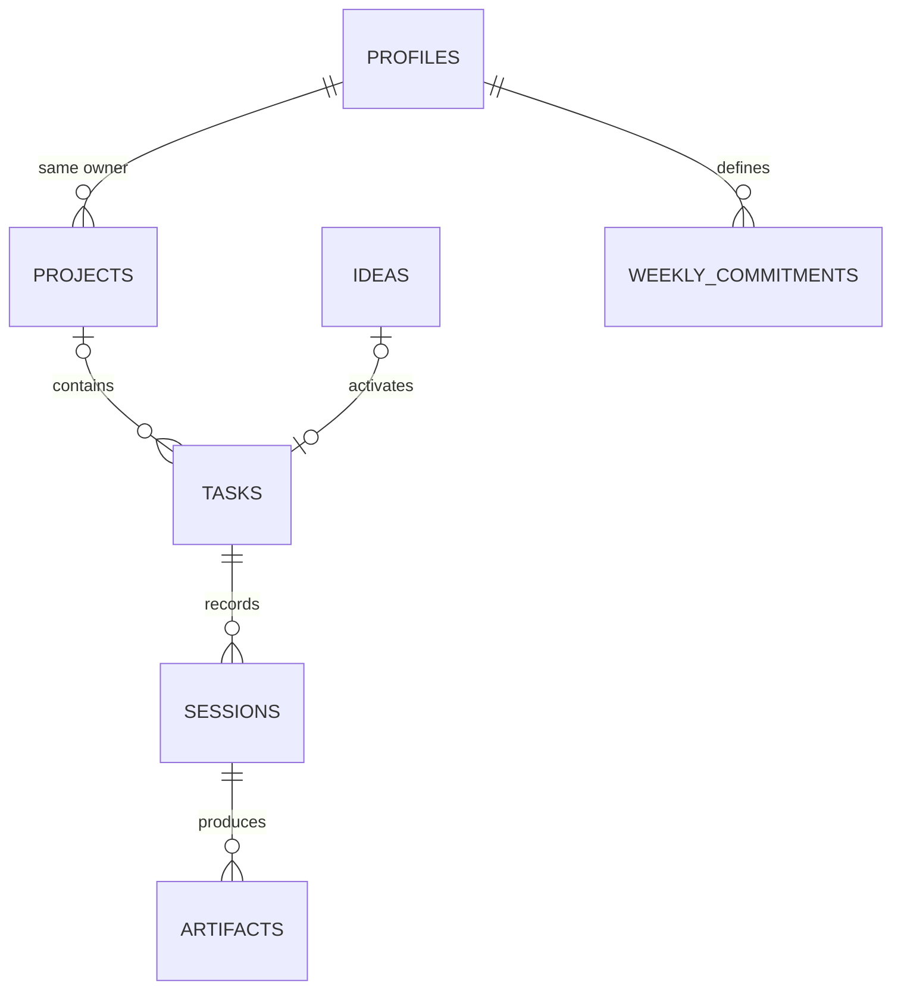

# Database design — Convex

## Mental model

Convex stores documents in tables. Each document has `_id` and `_creationTime`. A schema validates document shapes; indexes support predictable query access. Relationships use typed document IDs. This is not SQL: a referenced ID is not an automatic ownership or foreign-key policy. Functions must verify existence, ownership and state.

## Current schema

| Table | Important fields | Index and use |
|---|---|---|
| profiles | owner, motive, timezone, weeklyTarget | by_owner: retrieve personal preferences |
| projects | owner, title, purpose, status | by_owner: project list |
| ideas | owner, title, notes, lane, optional taskId | by_owner: notebook list |
| tasks | owner, title, lane, status, projectId, ideaId, minutes, energy, doneWhen, nextStep, dependencies | by_owner; by_owner_status: candidates |
| sessions | owner, taskId, key, lane/title snapshots, outcome, contribution, nextStep, evidence, endedAt | by_owner_endedAt: history; by_owner_key: idempotency |
| artifacts | owner, sessionId, title, url, status, portfolioCandidate | by_owner: proof gallery |
| weeklyCommitments | owner, week, target, paused | by_owner_week: historical weekly target |

Indexes in Convex are not declared uniqueness constraints. Application code uses an indexed read and insert in one mutation when uniqueness is required. The starter session mutation does this for `(owner, key)` and verifies a reused key still belongs to the same task.

The diagram expresses intended logical ownership; it is not database-enforced cascading behaviour.

## First mutation walkthrough

`tasks.create` reads the authenticated identity, verifies an optional project's ownership, checks title/effort/energy/done condition, then inserts a ready task. Its caller does not submit owner, state, or creation time.

`tasks.recordSession` validates identity and task, checks the owner-scoped idempotency key, rejects blocked/completed work and unmet prerequisites, validates the contribution and URL, inserts the session, updates the task, and optionally inserts an artifact. Those writes belong to one Convex mutation transaction.

## Planned schema additions

- Milestones with explicit task membership and archive semantics.
- Server-backed active sessions: start time, finish time, unique key, smaller-step snapshot.
- Structured smaller steps with their own done conditions and completion state.
- Source/reference fields for ideas and flexible skill tags.
- Artifact asset IDs when image/video upload ships.
- Effective-date preferences and immutable weekly target snapshots.

These fields are not claimed as implemented by the current schema.

## Query and growth policy

The starter list caps its result at 200 records. This is a bounded development example, not production pagination; add cursor-based pagination before friends import larger histories. Use separate reactive queries for active candidates, recent sessions and historical pages. Avoid subscribing Today to every artifact and completed task.

## Time, deletion and migration

Store timestamps in UTC milliseconds. Derive Monday-start weeks using each user's saved timezone. Snapshot weekly targets so later edits do not rewrite streak history. The local baseline shows week counts only; it does not award historical streaks.

Prefer archive states for projects and ideas with history. Do not delete a parent while leaving dangling child references. Add authenticated account export/deletion explicitly before public release.

Local demo IDs are strings, not Convex IDs. A migration must create owner-scoped records, build an old-ID → new-ID map, rewrite references, and deduplicate import batches. Do not send the raw browser snapshot directly to database inserts.

Schema changes should start additive and optional, backfill existing documents, then tighten validation. Test against a development deployment before production.

Reference: [Convex schemas](https://docs.convex.dev/database/schemas).

## Authentication storage — Phase 2B

The packaged `betterAuth` Convex component now owns auth user/account/session/verification tables in its component namespace. These are separate from the app's `profiles` and `sessions` tables: an auth session tracks login, while an app session tracks focused work. Password hashing and auth persistence are delegated to Better Auth. We do not manually add credential columns to our schema. Email verification/recovery flows are not enabled yet. Browser-local task data has not been migrated.
