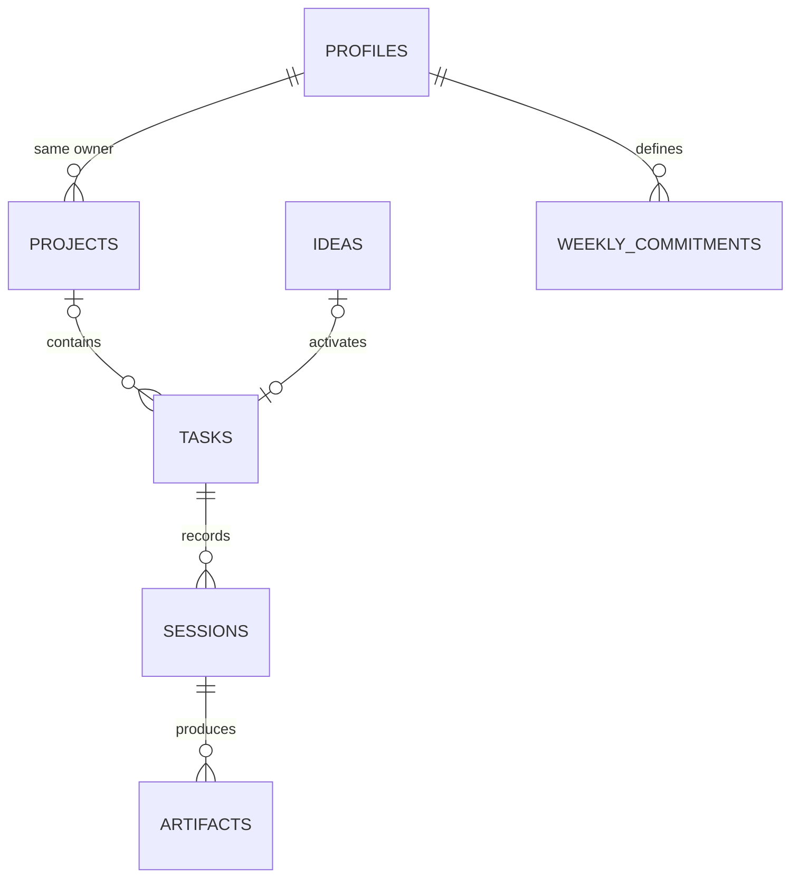

# Database design — Convex

## Mental model

Convex stores documents in tables. Each document has `_id` and `_creationTime`. A schema validates document shapes; indexes support predictable query access. Relationships use typed document IDs. This is not SQL: a referenced ID is not an automatic ownership or foreign-key policy. Functions must verify existence, ownership and state.

## Current schema

| Table | Important fields | Index and use |
|---|---|---|
| profiles | owner, motive, timezone, weeklyTarget | by_owner: retrieve personal preferences |
| projects | owner, title, purpose, status | by_owner: project list |
| ideas | owner, title, notes, lane, optional taskId | by_owner: notebook list |
| tasks | owner, title, lane, status, projectId, ideaId, minutes, energy, doneWhen, nextStep, dependencies, optional smaller action/done condition/minutes | by_owner; by_owner_status: candidates |
| activeSessions | owner, taskId, startedAt, optional chosen-focus snapshots | by_owner: one active session per account |
| sessions | owner, taskId, key, lane/title/done-condition snapshots, outcome, contribution, nextStep, evidence, endedAt | by_owner_endedAt: history; by_owner_key: idempotency |
| artifacts | owner, sessionId, title, url, status, portfolioCandidate | by_owner: proof gallery |
| weeklyCommitments | owner, week, target, paused | by_owner_week: historical weekly target |

Indexes in Convex are not declared uniqueness constraints. Application code uses an indexed read and insert in one mutation when uniqueness is required. The current recap mutation derives its `(owner, key)` retry identity from an owned active-session ID.

The diagram expresses intended logical ownership; it is not database-enforced cascading behaviour.

## First mutation walkthrough

`tasks.create` reads the authenticated identity, verifies an optional project's ownership, checks title/effort/energy/done condition, then inserts a ready task. Its caller does not submit owner, state, or creation time.

`tasks.startSession` validates identity, the owned ready/in-progress task and prerequisites, and creates one active record for the owner. `tasks.cancelSession` removes that record without credit. `tasks.recordSession` looks up an existing completed recap by the active-record ID, then validates the owned active record and task, contribution, next step and URL. It inserts the session, updates the task, optionally inserts an artifact and deletes the active record in one Convex mutation transaction. The caller cannot supply the owner, task, title, lane or start time at recap.

## Planned schema additions

- Milestones with explicit task membership and archive semantics.
- Separate completed-step history or multi-step sequencing beyond the current optional step. Historical sessions preserve completed smaller-step snapshots.
- Source/reference fields for ideas and flexible skill tags.
- Artifact asset IDs when image/video upload ships.
- Effective-date preferences and immutable weekly target snapshots.

These fields are not claimed as implemented by the current schema.

## Query and growth policy

`tasks.listPage` now uses Convex cursor pagination over the `by_owner` index, ordered newest first. The Work screen subscribes to an initial 12 records and explicitly loads 12 more while a cursor remains. The query maps records to a public task shape and omits the internal owner identifier. Future Today, recent-session and history queries should remain purpose-specific rather than subscribing every screen to every record.

## Time, deletion and migration

Store timestamps in UTC milliseconds. Derive Monday-start weeks using each user's saved timezone. Snapshot weekly targets so later edits do not rewrite streak history. The local baseline shows week counts only; it does not award historical streaks.

Prefer archive states for projects and ideas with history. Do not delete a parent while leaving dangling child references. Add authenticated account export/deletion explicitly before public release.

Local demo IDs are strings, not Convex IDs. The user chose to begin fresh in Convex and preserve the old browser copy. No automatic migration is planned. If an import is requested later, it must create owner-scoped records, map old IDs to new Convex IDs, rewrite references and deduplicate batches; raw browser snapshots must not be sent directly to database inserts.

Schema changes should start additive and optional, backfill existing documents, then tighten validation. Test against a development deployment before production.

Reference: [Convex schemas](https://docs.convex.dev/database/schemas).

## Authentication storage — Phase 2B

The packaged `betterAuth` Convex component owns auth user/account/session/verification tables in its component namespace. These are separate from the app's `profiles` and `sessions` tables: an auth session tracks login, while an app session tracks focused work. Password hashing and auth persistence are delegated to Better Auth. We do not manually add credential columns to our schema. Email verification/recovery flows are not enabled yet.

## Task operations — Phase 2C

- `listPage`: requires identity, filters by the indexed owner, paginates, and withholds `owner` from the UI response.
- `create`: derives owner, checks an optional project's ownership, validates effort/energy/text, and creates status `Ready`.
- `update`: loads the exact task, applies the same missing/foreign-record response through `assertOwner`, validates editable planning fields, and patches only those fields.

Task status, next step, dependencies and relational IDs cannot be overwritten through the edit form. Those lifecycle changes belong to later focused mutations. `convex-test` verifies list/edit isolation, pagination and foreign-project rejection against the real schema and function modules.

## Full-task session contract — Phase 2D backend slice

`activeSessions` has an owner index; start checks for an existing owner record in the same mutation that inserts a new one. The active document ID becomes the historical session's idempotency key. `sessions.startedAt` is optional in the schema so older development records remain valid; new recaps write it. Tests cover same-task start retry, a different-task conflict, cancellation without credit, missing/foreign IDs, invalid recap preserving the active record, replayed recap returning one session/artifact, dependency eligibility, Done and Blocked transitions.

The smaller-step extension adds optional `tasks.smallerStep`, `smallerDone` and `smallerMinutes`. All three must be present together; editing with all three omitted clears the step. Starting with `smaller: true` requires a defined step and snapshots focus title, done condition, minutes, task title and lane in `activeSessions`. Recap writes the focus snapshot into history. A finished smaller step leaves the parent `In progress`; the server clears the task's current smaller step only when it still matches the snapshot, so an edit made during focus is not lost. Optional schema fields keep older development documents valid. `/work` can create/edit the step, and `/today` now calls the session functions.

`tasks.todayOverview` validates temporary capacity/energy values, queries owned Ready and In progress tasks through `by_owner_status`, reads the six latest owned sessions through `by_owner_endedAt`, and looks up the single owned active session. It checks prerequisite ownership/completion before returning at most three recommendations. It never returns the owner identifier. The query is currently unbounded in its eligible-task read; revisit candidate-pool pagination as accounts grow. Existing browser-local records are neither read by Today nor imported automatically.

## Ideas and deliberate activation — Phase 3B bounded slice

`ideas.listPage` subscribes to one owner's ideas through `by_owner` with cursor pagination, returning only the fields the UI needs. `create` validates a trimmed title, lane and notes length; `updateNotes` checks exact record ownership. `activate` checks the owned idea, then creates a Ready task with `ideaId` and patches the idea with `taskId` in one mutation. A retry returns the already linked owned task rather than creating another. The task lane comes from the idea; title, effort, energy and done condition come from the activation form and are validated on the server. Capturing an idea alone does not affect Today. The old browser idea remains untouched under the user's fresh-cloud-start choice.
