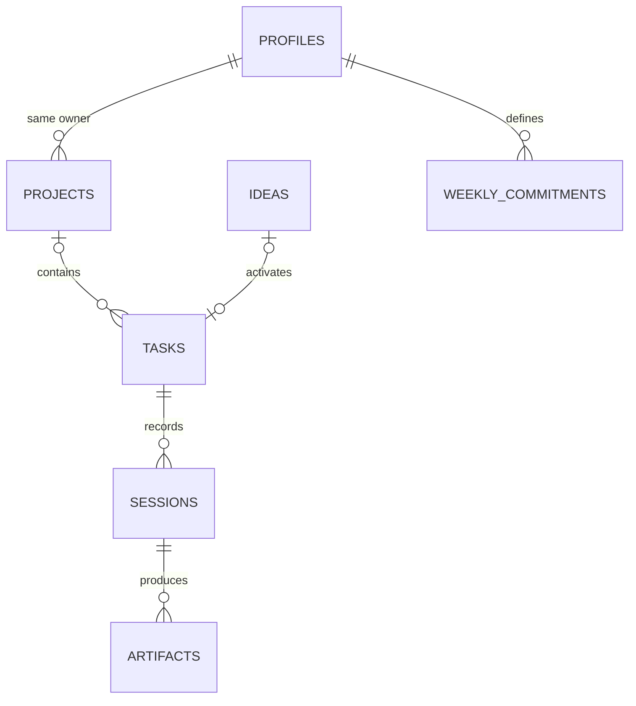

# Database design — Convex

## Mental model

Convex stores documents in tables. Each document has `_id` and `_creationTime`. A schema validates document shapes; indexes support predictable query access. Relationships use typed document IDs. This is not SQL: a referenced ID is not an automatic ownership or foreign-key policy. Functions must verify existence, ownership and state.

## Current schema

| Table | Important fields | Index and use |
|---|---|---|
| profiles | owner, motive; optional timezone, weeklyTarget (legacy, unused), pinnedTaskId, laneFocus, onboardedAt, focusQuotes, focusMusic, reminderOn, reminderTime, reminderDays | by_owner: motive, timezone, pin, lane and focus/reminder preferences, onboarding |
| projects | owner, title, purpose, status (Active / Done / Archived); optional outcome, ideaId (originating idea) | by_owner: options; by_owner_status: project lists |
| milestones | owner, projectId, title, order; optional doneWhen, completedAt | by_project (projectId, order): ordered milestones; by_owner: firsts, export |
| ideas | owner, title, notes, lane; optional taskId, archivedAt, brainstorm (problem, audience, hook, smallestBuild, skills, references, openQuestions, decisions) | by_owner: notebook and archived views |
| tasks | owner, title, lane, status (Ready / In progress / Blocked / Done / Archived), minutes, energy, doneWhen, nextStep, dependencies; optional archivedFrom, archivedWithProject, projectId, milestoneId, ideaId, smaller action/done condition/minutes | by_owner; by_owner_status: Today candidates and Work views (Active is the "In progress"–"Ready" range); by_project; by_milestone |
| activeSessions | owner, taskId, startedAt; optional chosen-focus snapshots, recommended, swapReason | by_owner: one active session per account |
| sessions | owner, taskId, key, lane/title/done-condition snapshots, outcome, contribution, nextStep, evidence, endedAt; optional startedAt, plannedMinutes, projectId snapshot, recommended, swapReason | by_owner_endedAt: history and rhythm windows; by_owner_key: idempotency; by_task and by_owner_project: case studies |
| artifacts | owner, sessionId, title, url, status (Draft / Ready to share / Published), portfolioCandidate; optional notes, skills, publishedUrl, publishedOn, imageId, candidateSince | by_owner; by_owner_status and by_owner_candidate: Proof views; by_session: Journey evidence; by_image: one owner per uploaded file |
| weeklyCommitments | owner, week (Monday key), target, paused | by_owner_week: target in force from a week; a pause applies to its own week only |
| reflections | owner, week, learning, intention | by_owner_week: one private reflection per week |
| weekPlans | owner, week (Monday key), intention, taskIds | by_owner_week: the steps lined up in the weekly review, one plan per week |
| apiTokens | owner, name, hash (SHA-256), prefix; optional lastUsedAt | by_hash: the MCP endpoint finds the owner; by_owner: Settings → Assistants |
| inbox | owner, source (token name), proposal (session / task / idea / milestone / nextStep) | by_owner: the Inbox on Today; nothing counts until approved |
| pushSubscriptions | owner, endpoint, p256dh, auth | by_owner: a person's devices; by_endpoint: one row per browser |
| taskEvents | owner, taskId, kind, at, source; optional projectId, note | by_task (taskId, at): a task's timeline; by_owner_at: the activity feed and deletion |

Indexes in Convex are not declared uniqueness constraints. Application code uses an indexed read and insert in one mutation when uniqueness is required. The current recap mutation derives its `(owner, key)` retry identity from an owned active-session ID.

```mermaid
erDiagram
  PROFILES ||--o{ PROJECTS : "same owner"
  PROJECTS o|--o{ TASKS : contains
  IDEAS o|--o| TASKS : activates
  TASKS ||--o{ SESSIONS : records
  SESSIONS ||--o{ ARTIFACTS : produces
  PROFILES ||--o{ WEEKLY_COMMITMENTS : defines
```

The diagram expresses intended logical ownership; it is not database-enforced cascading behaviour.

## First mutation walkthrough

`tasks.create` reads the authenticated identity, verifies an optional project's ownership, checks title/effort/energy/done condition, then inserts a ready task. Its caller does not submit owner, state, or creation time.

`tasks.startSession` validates identity, the owned ready/in-progress task and prerequisites, and creates one active record for the owner. `tasks.cancelSession` removes that record without credit. `tasks.recordSession` looks up an existing completed recap by the active-record ID, then validates the owned active record and task, contribution, next step and URL. It inserts the session, updates the task, optionally inserts an artifact and deletes the active record in one Convex mutation transaction. The caller cannot supply the owner, task, title, lane or start time at recap.

## Planned schema additions

Implemented on 2 October (see "Product phases" below):
- milestones with explicit task membership and archive semantics;
- idea brainstorm and reference fields, and skill tags on evidence;
- artifact image IDs;
- effective-dated weekly commitments.

Still planned: a separate history of completed smaller steps (sessions already snapshot each finished step), and multi-step sequencing beyond one optional smaller step.

## Query and growth policy

`tasks.listPage` uses Convex cursor pagination over the `by_owner` index, ordered newest first. The Work screen subscribes to an initial 12 records and explicitly loads 12 more while a cursor remains. `journey.listPage` uses `sessions.by_owner_endedAt` to show 12 recent owned recaps at a time. `proof.listPage` pages owned artifacts through `artifacts.by_owner` and reads only matching-owner source sessions. These queries omit the internal owner identifier. Journey derives lane counts only from currently loaded records and labels that limit in the UI. Future all-time and weekly summaries need a separate bounded design; do not treat a page as a complete history.

## Journey history — Phase 2E

`journey.listPage` requires a trusted identity, indexes into only that owner's saved `sessions`, orders by `endedAt` descending, paginates and projects the fields needed for Journey. Cancelled focus records are removed by `tasks.cancelSession` before a recap exists, so they cannot appear in history. The query reads snapshots of the completed focus title and lane, so later task edits do not rewrite the contribution story. Tests cover signed-out rejection, two-account isolation, cancelled focus exclusion and pagination. No table or dependency was added.

## Proof gallery — Phase 4B bounded slice

`tasks.recordSession` already validates an optional HTTP(S) evidence URL and inserts a Draft `artifacts` document with the same owner and new session ID. `proof.listPage` derives the owner from trusted auth, pages artifacts by `by_owner`, fetches each linked session, and includes its story only when its owner also matches. If a malformed artifact points to another owner's session, the source is null rather than leaked. The query returns no owner or recap idempotency key. The UI reads these private drafts and opens their links; status editing, publishing URLs and candidate controls are not connected yet. No schema or dependency changed.

## Settings motive — Phase 2F

`settings.getProfile` derives the trusted owner and returns only that owner's motive or null for a new account. `settings.saveMotive` trims and validates 1–1000 characters, then creates the owner's profile or patches only its motive in one mutation. The indexed lookup and insert share a transaction; the index itself is not a uniqueness constraint. `timezone` and `weeklyTarget` are optional in the schema so a newly created profile does not silently acquire invented week rules. Existing profile values survive a motive edit. The shared sidebar subscribes to `getProfile` only after Convex authentication. No local/browser data is read or imported.

## Time, deletion and migration

Store timestamps in UTC milliseconds. Derive Monday-start weeks using each user's saved timezone. Snapshot weekly targets so later edits do not rewrite streak history. The local baseline shows week counts only; it does not award historical streaks.

Prefer archive states for projects and ideas with history. Do not delete a parent while leaving dangling child references.

**Archiving a project** (`projects.setStatus`, from 9 October 2026) also archives its open tasks (Ready, In progress, Blocked) through the same helper as a task's own Archive (`lib/taskArchive.ts`): `archivedFrom` keeps each status, and `tasks.archivedWithProject` marks them. Archived prerequisites stop blocking, so work elsewhere that waited on them can reach Today. Leaving Archived (Make active, or Done) restores exactly the marked tasks; tasks archived on their own before stay archived. Done tasks are untouched. Backups carry the marker.

**Deleting a project** (`projects.remove`, 9 October 2026; `projects.deletePreview` counts it first):
- **Deleted:** the project, its milestones, phases and docs, its tasks, their `taskEvents`, their sessions (a session's `taskId` is required), and those sessions' artifacts with their screenshots.
- **Unlinked:** prerequisites on the deleted tasks, other tasks' links to the deleted milestones, the `projectId` snapshot on sessions whose task moved to another project, `ideas.taskId` (the idea goes back to Brainstorming and keeps its research), week-plan steps, the pin, and Inbox proposals that name a deleted record.
- **Refused** while a focus session runs on one of its tasks. It all happens in one transaction. Add authenticated account export/deletion explicitly before public release.

Local demo IDs are strings, not Convex IDs. The user chose to begin fresh in Convex and preserve the old browser copy. No automatic migration is planned. If an import is requested later, it must create owner-scoped records, map old IDs to new Convex IDs, rewrite references and deduplicate batches; raw browser snapshots must not be sent directly to database inserts.

Schema changes should start additive and optional, backfill existing documents, then tighten validation. Test against a development deployment before production.

Reference: [Convex schemas](https://docs.convex.dev/database/schemas).

## Authentication storage — Phase 2B

The packaged `betterAuth` Convex component owns auth user/account/session/verification tables in its component namespace. These are separate from the app's `profiles` and `sessions` tables: an auth session tracks login, while an app session tracks focused work. Password hashing and auth persistence are delegated to Better Auth. We do not manually add credential columns to our schema. Email verification/recovery flows are not enabled yet.

## Task operations — Phase 2C

- `listPage`: requires identity, filters by the indexed owner, paginates, and withholds `owner` from the UI response.
- `create`: derives owner, checks an optional project's ownership, validates effort/energy/text, and creates status `Ready`.
- `update`: loads the exact task, applies the same missing/foreign-record response through `assertOwner`, validates editable planning fields, and patches only those fields.

Task status, next step, dependencies and relational IDs cannot be overwritten through the edit form. Those lifecycle changes belong to later focused mutations. `convex-test` verifies list/edit isolation, pagination and foreign-project rejection against the real schema and function modules.

## Full-task session contract — Phase 2D backend slice

`activeSessions` has an owner index; start checks for an existing owner record in the same mutation that inserts a new one. The active document ID becomes the historical session's idempotency key. `sessions.startedAt` is optional in the schema so older development records remain valid; new recaps write it. Tests cover same-task start retry, a different-task conflict, cancellation without credit, missing/foreign IDs, invalid recap preserving the active record, replayed recap returning one session/artifact, dependency eligibility, Done and Blocked transitions.

The smaller-step extension adds optional `tasks.smallerStep`, `smallerDone` and `smallerMinutes`. All three must be present together; editing with all three omitted clears the step. Starting with `smaller: true` requires a defined step and snapshots focus title, done condition, minutes, task title and lane in `activeSessions`. Recap writes the focus snapshot into history. A finished smaller step leaves the parent `In progress`; the server clears the task's current smaller step only when it still matches the snapshot, so an edit made during focus is not lost. Optional schema fields keep older development documents valid. `/work` can create/edit the step, and `/today` now calls the session functions.

`tasks.todayOverview` validates temporary capacity/energy values, queries owned Ready and In progress tasks through `by_owner_status`, reads the six latest owned sessions through `by_owner_endedAt`, and looks up the single owned active session. It checks prerequisite ownership/completion before returning at most three recommendations. It never returns the owner identifier. The query is currently unbounded in its eligible-task read; revisit candidate-pool pagination as accounts grow. Existing browser-local records are neither read by Today nor imported automatically.

## Ideas and deliberate activation — Phase 3B bounded slice

`ideas.listPage` subscribes to one owner's ideas through `by_owner` with cursor pagination, returning only the fields the UI needs. `create` validates a trimmed title, lane and notes length; `updateNotes` checks exact record ownership. `activate` checks the owned idea, then creates a Ready task with `ideaId` and patches the idea with `taskId` in one mutation. A retry returns the already linked owned task rather than creating another. The task lane comes from the idea; title, effort, energy and done condition come from the activation form and are validated on the server. Capturing an idea alone does not affect Today. The old browser idea remains untouched under the user's fresh-cloud-start choice.

## Lifecycle and archive — review fixes, 2 October 2026

The schema change is additive, so existing documents stay valid and no migration was needed. The development push accepted it against existing data.

- **Tasks** gain the status literal `Archived`, plus an optional `archivedFrom`, which holds one of the four working statuses.
- **Ideas** gain an optional `archivedAt` timestamp.

| Mutation | Allowed from | Result |
|---|---|---|
| `tasks.unblock(taskId, nextStep)` | Blocked | Ready, with the new next step. The blocker stays in the session history that recorded it |
| `tasks.reopen(taskId, nextStep)` | Done | In progress, with the new next step |
| `tasks.archive(taskId)` | Any status; repeating it is harmless | Archived, with `archivedFrom` set. Refused while that task's session is active |
| `tasks.restore(taskId)` | Archived; repeating it is harmless | `archivedFrom` (or Ready), and `archivedFrom` removed |
| `ideas.archive` / `ideas.restore` | Any idea | Sets or removes `archivedAt`. Notes and the linked task are untouched; activation refuses an archived idea |

How the views and rules read this data:

- **Views.** `tasks.listPage(view)` reads Active through `by_owner` with a status filter (Ready or In progress), and the other views through `by_owner_status`. `ideas.listPage(view)` filters on whether `archivedAt` is missing; Convex filter equality accepts `undefined` for a missing field.
- **Sessions.** `startSession` and `recordSession` accept only Ready or In-progress tasks. A prerequisite must be Done or archived (set aside) before its dependents can start; restoring an archived prerequisite makes it block again.
- **Motive.** An empty motive now clears an existing profile's motive. A new account that saves nothing gets no profile.

Tests cover each transition, views, ownership rejection, idempotency, active-session protection, and exclusion from Today.

## Product phases — 2 October 2026

Every change below is additive: new tables, new optional fields and new indexes. Existing documents stay valid, so no migration is needed. Run `npm run backend` to push the schema to your development deployment.

**Weekly rhythm (4A).** A `weeklyCommitments` document means "from this week on, the target is N". The target in force for a week is the latest commitment at or before it, while `paused` applies only to that document's own week.
- The first target applies to the current week.
- Later changes create a document for next week, so a finished week keeps its target and its result.
- `rhythm.setRhythm` and `setPause` accept only the person's current week: the key must match the week in their timezone (the one being saved, or the saved one for pauses), allowing 5 minutes of clock difference. If the server runtime doesn't know that timezone, the fallback is a week that is current somewhere on Earth (Monday up to 14 hours ahead of the server clock, or up to 7 days 12 hours behind). A finished week's target can't be edited. Results are derived in the saved timezone, so changing the timezone can regroup sessions near midnight into a neighbouring day or week.
- `reflections` holds one learning and one intention per week; empty text deletes the reflection.
- Week results and streaks aren't stored. The browser derives them from commitments and session end times in the person's timezone (see SYSTEM_DESIGN).

**Proof workflow (4B).** Artifacts gain `notes`, `skills`, `publishedUrl` and `publishedOn` (a date key), `imageId` (Convex file storage) and `candidateSince`.
- Published requires a valid http(s) link and a date that isn't in the future. Moving back to Draft or Ready clears both, so the record never claims a publication that isn't true.
- An upload is accepted only if its stored metadata says PNG, JPEG, WebP or GIF of up to 5 MB, and no other artifact already uses it (`by_image`). Convex measures the size itself; the content type is the one the browser declared, so this refuses ordinary mistakes but doesn't prove the bytes are an image. Screenshot URLs are unguessable, but anyone holding one can open it.
- A rejected file is deleted and the reason *returned*, because throwing would roll the deletion back.
- `proof.addToSession` creates a Draft for an owned past session.

**Projects and milestones (3A).** Milestones are ordered per project. `completedAt` is maintained by `lib/projects.refreshMilestone` after every change to a linked task: create, edit, recap, reopen, archive, restore and idea deactivation. A milestone is complete when it has at least one task that isn't archived and all of them are Done.
- Task links are checked by `lib/projects.taskLinks`. A milestone implies its project, and new links need an Active project; an existing link to a finished project is kept on edit.
- Only tasks with no project, or an Active one, reach Today or can start a session.
- Sessions snapshot the task's `projectId`, so a case study keeps its history if a task later moves.
- `projects.caseStudy` reads snapshot sessions plus older sessions found through `by_task`.

**Ideas and prerequisites (3B).**
- Ideas gain an optional `brainstorm` object; its references must be http(s) links, and there are at most 10 skills and 10 references.
- The stage is derived, not stored: Archived, then Active (linked task), then Brainstorming (any structured field), then Captured.
- `ideas.activate` can add a smaller step and link a project or milestone, or start a new project (`projects.ideaId`).
- `ideas.deactivate` archives the linked task (unless it's Done), clears the pin if it pointed at that task, and unlinks it.
- Prerequisites are checked by `lib/taskRules.dependencyValues`: owned, at most 10, never the task itself, and never a loop (found by a walk through what the chosen tasks wait on). A newly added prerequisite can't be archived; one the task already had may stay after it is archived.
- A prerequisite stops holding a task back when it is Done **or Archived** (`lib/taskRules.prerequisiteCleared`), so a task is never hidden from Today behind work that was set aside. Restoring the prerequisite makes it block again.
- `tasks.listPage` returns each task's prerequisites with title and status. `tasks.prerequisiteOptions({ taskId? })` returns the newest 300 tasks that aren't archived plus, when editing, that task's own prerequisites, so a form never drops one it didn't show.

**Recommendations (3C).**
- `profiles.pinnedTaskId` is set by `tasks.pin` and cleared automatically when that task finishes or is archived.
- `profiles.laneFocus` favours one lane by counting it one session fewer.
- `activeSessions`/`sessions` record `recommended` and an optional `swapReason`, a fixed list of five.
- Today reads at most the 200 oldest Ready and 200 oldest In-progress tasks, always plus the pinned one.

**Delight (4C).** `journey.summary` derives lifetime counts and "firsts" from records each time it's read: first session, first showcase and writing sessions, first completed milestone, first portfolio candidate (from `candidateSince`) and first published piece. Nothing is stored as an award, so nothing can be granted twice, and a first disappears if its record does.

**Data control (5A).**
- `data.exportAll` returns every owned record (except active sessions and image files) with original IDs, so links can be rebuilt.
- `data.importBackup` checks every field and refuses another format, another version, more than 4,000 records, or a workspace that isn't empty. It runs as one transaction, so a backup with a missing reference changes nothing.
- `data.deleteBatch` deletes up to 400 owned documents per call, artifacts first with their image files and profiles last. The browser repeats it until `done`.
- Account deletion then removes the Better Auth user (see AUTH_SETUP).

## Ember Glass redesign — 2 October 2026

The redesign needs three small, additive backend changes. Existing documents stay valid. Run `npm run backend` to push them and regenerate `convex/_generated`.

- **`sessions.skills`** (optional string array) holds the skills practised, chosen in the recap. `tasks.recordSession({ …, skills? })` takes up to 5 skills of up to 40 characters each, compared case-insensitively (the first spelling is kept). They travel in export and restore.
- **`journey.bloom({ since, until? })`** returns the Mind Bloom: up to eight skills from sessions saved in the window, through `by_owner_endedAt` (newest 1,000). A session counts once per skill, whether the skill was tagged on the session or on any of its evidence. Each petal takes the lane most of its sessions were in, and the newest session's lane wins a tie. It also returns `sessions` and `tagged`. Pure logic and tests: `lib/bloom.ts`.
- **`journey.skillSuggestions`** returns your 12 most-used skills, offered as chips in the recap.
- **`proof.pipeline`** returns the Draft, Ready to share and Published counts (each capped at 1,000) and the newest piece that isn't published yet, for Today's proof card.
- **Read additions:**
  - `tasks.todayOverview` choices carry `projectId` and `energy`.
  - `journey.listPage` returns `skills` on each session and on its artifacts.
  - `ideas.listPage` returns `task: { title, status } | null` for an active idea's linked task.

## Ritual redesign — 6 October 2026

The Ritual design (documents/DESIGN_SYSTEM.md) needs these additive changes. Existing documents stay valid. Run `npm run backend` to push them to the development deployment and regenerate `convex/_generated`.

- **Schema:** `profiles` gains optional `onboardedAt`, `focusQuotes`, `focusMusic`, `reminderOn`, `reminderTime` and `reminderDays`. The new `weekPlans` table holds each week's intention and lined-up task ids.
- **Mind Bloom:** `lib/bloom.ts` now has eight fixed skills (Frontend, Interaction, Motion, Visual, Writing, Research, Systems, Shipping), each tied to a lane and full at 12 sessions. `journey.skillSuggestions` is gone; the recap offers the eight skills.
- **Today:** `tasks.todayOverview({ minutes, energy, lane?, projectId?, taskId?, week? })` (ids arrive as strings from links; one that isn't a valid id matches nothing) scopes the choices to an intent, and returns `alternatives` (the best fit from each other lane, at most two), `spark` (newest unlinked idea title), `intention` (this week's plan), `readyToShare` and `linedUpCount`. Tasks lined up in this week's plan rank right after the pinned task (`lib/recommend.ts`). `lastSession` carries `startedAt` and `taskId`.
- **Settings and onboarding:** `settings.getProfile` returns the preferences with defaults, and `needsOnboarding: true` for a brand-new account. New `settings.savePreferences`, `settings.completeOnboarding` and `settings.pinnedTask`.
- **Weekly review:** `rhythm.saveWeekPlan({ currentWeek, week, intention, taskIds })` saves the plan for this week or next (owned, open tasks only). `rhythm.overview` returns the latest four `plans` and each session's `startedAt`, `lane` and `skills`.
- **Journey:** `journey.activity({ since })` returns session end times (newest 5,000) for the contributions graph.
- **Projects:** `projects.list` returns `nextTask`, `lane` and `lastWorkedAt`; `projects.get` returns the same. `projects.createWithFirstStep` creates a project and its first task together.
- **Single reads for deep links:** `tasks.get`, `ideas.get` (for `/ideas?idea=`) and `proof.get` (for `/journey?tab=proof&publish=`) return one owned item in the list shape, or null. `ideas.activate` takes an optional `lane`.
- **Data:** export, restore and delete include `weekPlans` and the new profile fields. Restore maps plan task ids to the new task ids and refuses duplicate plan weeks.

## Assistants and the Inbox — 9 October 2026

See [ASSISTANTS.md](ASSISTANTS.md).
- **New tables:** `apiTokens` and `inbox`. `sessions.source` (optional) records where an approved session came from.
- **Reads for one owner, shared with the app:** `tasks.todayFor`, `projects.projectsFor` and `projects.projectFor`.
- **Writes for one owner, shared with the app:** `tasks.createTaskFor`, `ideas.createIdeaFor`, `projects.addMilestoneFor` and `tasks.saveLoggedSession` (a session logged after the fact, with the recap's rules).
- **Data:** export and restore carry `sessions.source`. `deleteBatch` also removes `inbox` and `apiTokens`. Tokens and pending proposals aren't exported.

## Evening reminders — 9 October 2026

- **profiles** gains `reminderEmail` (default on) and `lastReminderDay` (the local day the last reminder went out).
- **New table** `pushSubscriptions`.
- **Functions:**
  - `push.config`, `push.subscribe`, `push.unsubscribe` and `push.test`
  - `reminders.due` (internal: who is due now) and `reminders.sendDue` (internal action, run every 15 minutes by `crons.ts`)
- **Data:** backups carry `reminderEmail`; "Delete workspace data" removes devices too. See AUTH_SETUP.md for the keys.

## Moving tasks freely — Phase 1, 9 October 2026

See [PLAN-tasks-and-focus.md](PLAN-tasks-and-focus.md).
- **tasks** gains `startedAt`, `completedAt` and `skills`.
- **`tasks.setStatus({ taskId, status, note?, skills? })`** moves a task with no timer. Ready, In progress, Blocked and Done are allowed, with these rules:
  - **Blocked** needs a reason, which becomes the next step.
  - **Leaving Blocked or Done** needs a next step.
  - **Done** records `completedAt`, merges up to 5 skills, clears the pin and refreshes the milestone.
  - A task with a running focus session is refused, and so is an archived one.
- **`taskEvents`** is written by create, setStatus, unblock, reopen, archive, restore, the focus recap ("focused" plus the status it caused) and approved logged work ("logged").
- **The bloom** also counts a task finished in the window, once per skill, unless one of its sessions in the window already counted that skill. It returns `finished`.
- **Data:** backups carry the new task fields. Events aren't exported yet (Phase 2). "Delete workspace data" removes them.

## The project constellation — 9 October 2026

See [PLAN-project-constellation.md](PLAN-project-constellation.md) and, for the assistant side, [ASSISTANTS.md](ASSISTANTS.md).
- **New tables:**
  - `phases`: a project's plan, phase by phase (`projectId`, `order`, `name`, optional goal, next step and done-when).
  - `projectDocs`: the documents a plan stands on. A code (1 to 4 letters or digits, unique in the project), title, summary, sections, a link (an https address or a repo path), the phases it feeds (`phaseIds`), next edit, done-when, `writtenAt` (absent while only planned), `updatedAt` and `source`.
  - `research`: an idea's research threads, each with its sources (`kind` read, interview, tried or brief, and `by`: "app" or the assistant's token name).
  - `reports`: one per idea, with findings and an optional `decision` (verdict, rule, kept, dropped).
- **Changed:** `milestones.phaseId` (optional; none means outside any phase) and `tasks.plannedSessions` (optional, 1 to 100).
- **Reads:** `constellation.get({ projectId })` derives the whole map from records: phase numbers from order ("00", "01"), milestone codes from order within the phase ("0A"), task codes ("0A·1"), % and state per phase, loose milestones and tasks, each doc's feeds and the tasks it informs, genesis through `projects.ideaId`, and activity from `taskEvents`. Nothing is stored twice.
- **Rules:** every helper checks the owner. A milestone's phase and a doc's phases must be in the same project. Removing a phase keeps its milestones (they move outside any phase) and removes it from every doc's feeds. A project has at most 40 phases and 40 docs. A doc link is `http(s)://…` or a repo path; any other scheme is refused.
- **Data:**
  - Export carries all four tables plus `milestones.phaseId` and `tasks.plannedSessions`. The new arrays are optional, so older backups still restore.
  - Restore maps project, phase and idea ids. It refuses a milestone or doc linked to another project's phase, a missing phase or idea, repeated doc codes in one project, two reports for one idea, more than 40 phases or docs in a project, and unsafe links. The summary counts `phases`, `docs`, `research` and `reports`.
  - "Delete workspace data" removes all four tables.
