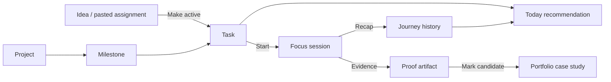

# Becoming — product features and experience map

Updated: 24 September 2026. This is the design handoff for the independent Becoming app. It describes the intended experience and labels the implementation status. Use it to redesign the dashboard and flows; the route structure, hierarchy and visual treatment are open to revision.

## The product in one sentence

Becoming helps a design engineer decide what to work on after a variable workday, make a meaningful contribution, and turn that work into visible portfolio evidence over time.

The core loop is **capture → choose → focus → reflect → collect proof → review progress**. A scheduled ChatGPT assignment is an idea until the user deliberately chooses to make it active. The app should never invent work, force a daily deadline, or claim that a social post was published when it was only drafted.

## Read this status key first

| Label | Meaning |
|---|---|
| Live cloud | Uses the signed-in Convex account in the current app. |
| Local prototype | Works in the current app but saves only in this browser. The signed-in account does not own this data. |
| Planned | Product direction, not a working feature yet. |
| Optional later | Consider after real usage demonstrates a need. |

At this checkpoint, **Work task list/create/edit and Today recommendation/focus/recap are live cloud** for signed-in users. Today uses temporary time/energy selections, while meaningful tasks and sessions live in Convex. Ideas, Proof, Journey and Settings are **local prototypes awaiting cloud migration**. Better Auth email/password works for development; verification and recovery email are planned. The old standalone HTML prototype is a design reference, not the live app.

## Experience principles for your design

1. One clear next action should dominate Today. Alternatives, counts and motivation support that decision.
2. Capacity is flexible. A 15-minute evening, a longer session and a rest day are all valid.
3. Saving an idea does not create an obligation. Activation is a separate decision.
4. Progress is a recorded contribution, not time spent with the app open.
5. Large projects, small showcases and writing should all move over time without splitting every evening into three jobs.
6. Every status should explain itself in words, not color alone.
7. The app should expose the difference between a draft, evidence ready to share and a published link.
8. A first-time empty account must remain honest; sample content is explicitly labelled sample content.

## Navigation and main screen contract

The current primary routes are `/today`, `/work`, `/ideas`, `/proof`, `/journey`, `/settings`, plus `/account`. Your design may reorganize their layout or names. Preserve the underlying user questions until a better flow is deliberately chosen.

| Area | User question | Main content and actions | Status |
|---|---|---|---|
| Account / welcome | Can I access my private work? | Sign up/in/out, identity state, first-run setup; later verification/recovery | Development sign-in live cloud; onboarding planned |
| Today | What should I do now? | Time and energy check-in, one explained recommendation, alternatives, start/resume, focused session, recap | Signed-in cloud flow live; visual direction open |
| Work | What have I committed to? | Projects, Showcases and Writing lanes; task list/detail; plan/edit; status and project context | Signed-in task list/create/edit live cloud; projects/status flow planned |
| Ideas | What might I build later? | Fast capture, pasted scheduled assignment, brainstorm, references, deliberate activation | Local prototype; richer cloud notebook planned |
| Proof | What can I show? | Artifacts, source work, drafts, ready/published links and portfolio candidates | Basic local evidence links; workflow planned |
| Journey | Am I becoming the engineer I want to be? | Sessions, weekly commitment, lane balance, streaks, milestones and skills evidenced | Basic local history/counts; cloud and richer progress planned |
| Settings | What rhythm and data controls suit me? | Motive, timezone, weekly target/pause, preferences, export/restore/account controls | Local motive/export; remaining controls planned |

## Suggested dashboard hierarchy: Today

This is a content priority, not a prescribed layout. You can make a compact dashboard, an editorial page or a different visual system.

1. **Context:** today/date, a short personal motive or project direction, and current capacity input. The user can change available minutes and energy each visit.
2. **Primary focus:** a concrete task or defined smaller step, its lane/project, estimated effort, done condition, and one plain-language reason it fits.
3. **Action:** Start or Resume. A task that is too large should offer its real smaller step only if one has been defined.
4. **Alternatives:** at most two useful choices, such as continuing a project or finishing a quick showcase. Choosing an alternative is explicit.
5. **Momentum:** a quiet weekly target and recent contribution. Do not put pressure on a missed day or fabricate a streak.
6. **Escape hatches:** add a task, browse Work/Ideas, adjust capacity, or take a break when nothing fits.

Useful dashboard states to design:

| State | What the user should understand | Primary action |
|---|---|---|
| First-run empty | There is no ready work yet; no recommendation is invented | Create a first task or activate an idea |
| Loading/auth | Private data is being checked; prior account data must not flash | Wait or retry |
| Ready recommendation | Why this fits the user's time, energy and recent lane balance | Start focus |
| Active focus | The selected task, stopping point and resumption context | Finish and reflect, or cancel |
| No feasible task | Work exists but does not fit current capacity | Change capacity, define smaller step, or choose explicitly |
| Blocked only | Blocked tasks need an unblock action before recommendation | Review blockers |
| Return after a gap | Last contribution and next step remain visible; no overdue pile is created | Resume or choose something else |
| Save failed | Work was not recorded; input remains available | Retry without losing the recap |

## Core journeys and transitions

### 1. First visit

`Welcome/account → motive and flexible weekly target → first project, first task, or skip → Today`.

The user can skip setup. A new cloud account starts empty unless a separate migration/import is explicitly chosen. Suggested first-task examples are labelled examples and do not appear as completed work.

### 2. Ordinary evening

`Today → choose minutes and energy → review one recommendation and reason → Start → focused session → Finish & reflect → Today/Journey/Proof`.

Starting records an active session; it does not mark the task done. Cancel records no contribution. A recap asks for outcome (`Finished`, `Made progress`, `Blocked`), what changed, and a next step or blocker when unfinished. An optional evidence link can be saved at the same time. The recap result changes task eligibility and updates history.

### 3. Partial progress and return

`Recap: Made progress → task In progress + saved next step → later Today → Resume`.

The next action should be visible without rereading every note. A completed smaller step advances the parent but does not falsely complete it or recur as the same recommendation.

### 4. Blocked work

`Recap: Blocked → task Blocked + blocker/unblock action → Work → resolve blocker → task Ready → Today`.

Blocked work is excluded from automatic recommendations. It remains visible in Work and history; the user has a clear way to restore it when the blocker is resolved.

### 5. Scheduled assignment or spontaneous idea

`Ideas → paste/capture assignment → brainstorm → leave in Ideas or Make active → define first ready task → Work → Today`.

The existing ChatGPT schedule continues to send assignments outside the app. In the first product version, the user manually pastes one they like. No ChatGPT API or automatic schedule connection is needed. Brainstorm fields can include the problem, intended user, distinctive visual/interaction hook, smallest build, skills, references, open questions and decisions. Quick capture should require little more than a title.

### 6. Larger project

`Work → Project → purpose/outcome/scope → milestones → ready tasks → Today sessions → completed milestone → Proof/Journey`.

A project should show the next concrete step and the work already done. Progress should use completed scope/counts; adding new tasks may change a percentage, so counts remain visible for honesty. Archive preserves history and removes a project from recommendations.

### 7. Small showcase or writing piece

`Work → Showcase/Writing task → focused session → demo/draft evidence → Proof → optional follow-up publication task`.

The primary lane of each session is counted once. An artifact can carry multiple skill tags without double counting the session. Posting to X/LinkedIn or publishing a portfolio page is a separate user action; the app tracks drafts and links.

### 8. Proof to portfolio

`Proof draft → add context, contribution, media/link → Ready to share → record published URL/date → Published → flag portfolio candidate`.

The first release tracks publishing status; it does not post externally. A portfolio candidate should retain its originating project/task/session so the story can later become a case study.

### 9. Weekly reflection

`Journey → review sessions, artifacts and lane balance → note a learning/next intention → adjust future weekly target or plan a pause`.

A week is Monday–Sunday in the saved timezone. A target change applies prospectively, so earlier streaks are not rewritten. A planned pause does not count as a successful week and should not be framed as failure.

## Feature inventory by domain

| Domain | Essential first usable product | Later enhancement |
|---|---|---|
| Identity | Private account, explicit loading/error/sign-out | Verified email, recovery, account deletion, friend onboarding |
| Tasks | Create/edit, ready/in-progress/blocked/done, estimates, energy, done condition, next step | Dependencies, pinning, bulk actions, search/filter |
| Focus | Start/cancel, recap, resume, smaller step | Timer and reminders if useful |
| Recommendations | Explainable capacity/energy/eligibility rules, two alternatives | User-tuned lane weights and feedback from real usage |
| Projects | Purpose, scope, milestones, linked tasks, archive | Rich project views and more planning tools |
| Ideas | Capture, paste assignment, brainstorm, activate deliberately | Structured imports and richer references |
| Proof | Evidence URL/asset, draft/ready/published, portfolio flag | Uploads and assembled case-study drafts |
| Journey | Session history, weekly target/streak, lane balance, milestone evidence | Activity garden or daily streak if motivating |
| Data control | Export/restore with versioned relationships | Optional offline support |
| Connections | Manual copy/paste from ChatGPT schedule | Optional ChatGPT, GitHub and Figma connections |

## The state vocabulary you can design around

| Object | States | Meaningful transition |
|---|---|---|
| Idea | Captured, Brainstorming, Active, Archived | `Make active` creates/links a ready task only after review |
| Task | Ready, In progress, Blocked, Done | Recap and explicit unblock controls change status |
| Focus session | Active, Cancelled, Finished recap | Cancel awards no progress; recap saves one contribution |
| Artifact | Draft, Ready to share, Published | Published needs a real URL/date; no external posting occurs |
| Project | Active, Archived, Done | Archive preserves linked history |
| Week | In progress, Met target, Missed, Planned pause | Derived from session records and the historical target |

Some state names here express the intended experience rather than current database fields. In particular, the present idea schema does not yet store all four idea states. Convex now stores active sessions and smaller-step snapshots, and the visible Today UI reads them from the signed-in account. Design can anticipate the full experience; code will arrive phase by phase.

## Important cross-screen relationships

Today is a decision surface, Work is the commitment and planning surface, Ideas is the low-pressure holding space, Proof is the evidence surface, and Journey is the reflection surface. Today and Work now share one underlying Convex task record.

## Forms, feedback and accessibility to include in designs

- Show field labels and the required done condition; keep save/cancel predictable.
- Preserve entered text after a network failure and distinguish pending from saved.
- Show task and artifact status in text as well as visual treatment.
- Design empty, loading, signed-out, validation-error, network-error and success states for each cloud screen.
- Keep the main action available with keyboard and at a 320px viewport; honor reduced motion.
- Use meaningful progress language. A session can record learning, investigation or a draft without pretending the task is complete.
- Separate account privacy from local prototype data while migration is incomplete.

## Suggested design work order

1. Redesign Today in three states: empty, recommended task and active session. Define the visual hierarchy before filling the page with metrics.
2. Design the recap, including finished/partial/blocked outcomes and a save failure. This is the most important form in the product.
3. Refine Work task cards/detail and show how a task moves between lanes/statuses and links to a project.
4. Design quick Idea capture and a larger brainstorm detail; make activation visibly deliberate.
5. Design Proof and Journey using one real task/session/artifact example, then return to the dashboard with those relationships in mind.
6. Check mobile, keyboard focus, contrast and reduced-motion states as part of each screen rather than at the end.

## What engineering will do next

The Phase 2D backend and visible Today client now supply server-backed full-task and smaller-step start/cancel/recap with ownership and idempotency checks. Existing browser-local data has not been imported or deleted; the import choice and migration of Ideas, Proof, Journey and Settings remain for review. Projects, richer motivation, production auth and integrations remain later phases in `PLAN.md`.

## Questions to mark directly in your designs

- Do you want Today to feel like a calm single recommendation or a denser dashboard? Which supporting information actually helps you choose tonight?
- Should a focused session be a dedicated page, an expanded Today state, or a side panel on desktop? How should it collapse on mobile?
- What should be prominent when you return after several days: the last next step, the project goal, or a fresh recommendation?
- Should Work show three visible lanes at once or one filterable list on narrow screens?
- What evidence do you create most often: live demo, screenshot, clip, code link, Figma frame, or written explanation?
- What would make a weekly streak encouraging rather than pressuring?

Keep these as design decisions, not hidden engineering assumptions. The current visual prototype is in `prototype.html`; implementation status lives in `PLAN.md` and `LEARNING_LOG.md`.
