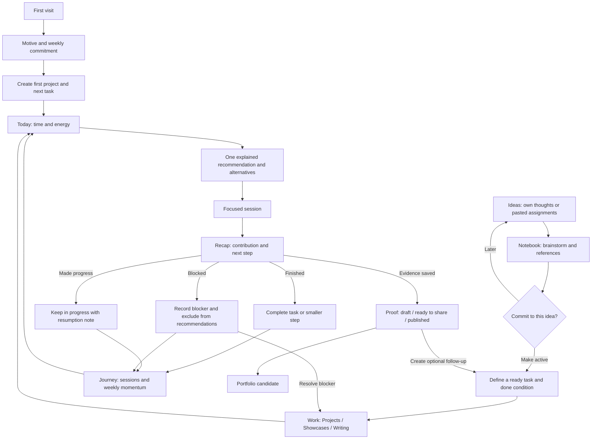

# Form — initial product requirements & experience specification

Version 0.1 · 14 September 2026 · Working title, open for discussion

## 1. Product intent

Form is a private personal workspace that helps Vimal become a design engineer through consistent, balanced, visible work. It connects future ideas, selected assignments, larger projects, focused sessions, and portfolio evidence.

**Product promise:** Open the app, find a worthwhile next action that fits tonight, and see how it contributes to the body of work you are building.

The problem is competing priorities after a full workday: whether to advance a large app, finish a component, write, publish, or explore. A rigid timetable does not fit variable time and energy. New scheduled assignments should remain inspiration until deliberately selected.

## 2. Agreed direction and assumptions

### Agreed with the user

- Flexible planning rather than fixed evening slots.
- Balance larger projects, small showcases, and writing/sharing across sessions.
- Preserve the current ChatGPT assignment schedule and its variety.
- An assignment becomes work only when the user selects it.
- Support future ideas and brainstorming before commitment.
- Include motivating streaks or light gamification.
- Track completed work and evidence of design-engineering growth.
- Defer the ChatGPT connection; core workflows do not require a model API.

### Initial design assumptions to validate

- A private, single-user product is the first release; multi-user accounts are later.
- A default target of three sessions per week is a starting suggestion, editable during setup.
- A session qualifies through a recorded concrete contribution: a decision, implementation, investigation, draft, or deliverable. Opening the app does not qualify.
- Start with one primary project, up to one additional active project, and a small ready queue. These are soft recommendations, not hard restrictions.
- The initial product name and the sample content in the prototype are illustrative.

## 3. Jobs to be done

1. After work, choose a useful action without having to plan everything again.
2. Save an interesting idea without creating another obligation.
3. Resume unfinished work with context after an unpredictable break.
4. Move all three work lanes forward without splitting every evening between them.
5. Gather screenshots, demos, decisions, and links while working so publishing is easier.
6. See tangible evidence that I am becoming the design engineer I want to be.

## 4. Information architecture

| Area | Main question | Main contents |
|---|---|---|
| Today | What should I do next? | Capacity, one explained recommendation, alternatives, next likely focus, session controls |
| Work | What have I committed to? | Projects / Showcases / Writing lanes, ready and in-progress tasks, milestones, details |
| Ideas | What might I build? | Quick capture, saved assignments, brainstorm notes, references, activation |
| Proof | What have I made? | Screenshots and demo links, drafts, published work, portfolio candidates |
| Journey | Am I moving forward? | Weekly commitment, streak, session history, lane balance, skill evidence, milestones |
| Settings | How should the app support me? | Motive, timezone, weekly target, weekly pause, preferences; data controls after persistence ships |

Desktop uses a restrained left navigation and broad main canvas. Mobile reflows into a compact header, wrapping navigation, and a single column. Session work and recap occupy the main canvas, avoiding a cramped modal.

## 5. Complete app flows

### A. First visit and setup

Welcome → write or accept a personal motive → choose weekly session target → create a first project or explore sample content → define one milestone and a next task → Today.

Setup is skippable. If no work exists, Today shows “Add your first focus,” linking to project creation and Ideas. No fabricated recommendation, streak, or progress appears in an empty account. Sample mode is explicitly labelled.

### B. Ordinary evening

Today → choose available time (15 / 30 / 60 / 90 minutes) and energy (Low / Steady / High) → read recommendation and reason → inspect or swap → start → work → recap → save progress → refreshed Today.

The focus contains a concrete action, lane, related project, expected duration, skill practised, a stopping condition, and an optional smaller step. Starting creates a session record; it does not mark the task complete.

### C. Session recap

End session → choose Finished / Made progress / Blocked → record a contribution and optional next step → optionally attach artifact URL or image → confirm → session enters Journey; linked proof enters Proof; recommendation recalculates.

- Finished: task moves to Done. Parent milestone updates from its completed tasks.
- Made progress: task stays In progress; save the next action and optionally revise remaining duration.
- Blocked: task leaves the recommendation pool until the blocker is resolved; record the blocker and an unblock action.
- Abandon before doing work: cancel session with no streak credit.
- Save is idempotent; repeated clicks do not create duplicate sessions or credit.

### D. New idea or scheduled assignment

Ideas → Add idea → enter title and freeform notes, optionally lane and reference → save → brainstorm detail.

An existing ChatGPT response can be pasted into the notes field unchanged. The user supplies planning fields; automatic parsing and scheduled delivery are deferred.

Brainstorm detail includes problem, intended user, distinctive interaction, smallest build, skills, references, open questions, and decisions. None is mandatory for quick capture. Keep it as an idea, archive it, or choose Make active.

### E. Activate an idea

Make active → select lane and optional parent project → define first achievable task, duration, energy, and done condition → review → add to Ready → eligible for Today.

Ideas and tasks retain a link so the original reasoning remains available. Activation is deliberate and reversible. Moving it back to Ideas removes it from recommendations while preserving notes and history.

### F. Larger project

Work → Projects → project detail → outcome and scope → milestones → concrete tasks → choose next ready step → start session.

Project example: Form → milestone “Usable Today flow” → sketch states / build focus card / connect selection / test keyboard flow. Progress is based on completed scope; adding tasks may change the percentage. Show completed counts alongside the percentage to explain this.

### G. Showcase and writing

Work → Showcases or Writing → item detail → scoped task → focus session → attach proof → optionally create a linked writing/publishing task.

A component inside a larger project can produce a separate showcase artifact. The session has one primary lane for balancing, while the artifact can carry several skill tags. This prevents double counting.

Writing tasks require an actual topic or available source material. Capturing a clip and drafting a post are legitimate tasks; suggested social angles are optional notes, not automatically required work.

### H. Missed days and return

Return → see last contribution and next step → adjust capacity → resume, choose a smaller step, or swap.

No automatic overdue backlog. Explicit deadlines, if added later, remain visible and are never silently moved. Weekly streak evaluates the chosen target; missed weeks remain visible in history while lifetime progress is retained. A planned pause excludes a whole week from streak evaluation without awarding a successful week.

### I. Proof to portfolio

Proof → select artifact → review context, contribution, assets, and links → mark Ready to share → attach published link and date → mark Published → optionally flag Portfolio candidate.

Exporting a case study and publishing directly to the portfolio/social platforms are later features. V1 tracks status and links only; changing status never sends anything publicly.

### J. Weekly reflection

Journey → review completed sessions and artifacts → inspect which lane received attention → note one learning and next week's intention → adjust target if needed.

### Flow map

## 6. Recommendation behaviour: initial rule-based policy

No model API is needed. The rules must be inspectable and predictable.

1. Eligible candidates are Ready or In progress tasks whose prerequisites are satisfied. Exclude Ideas, Done, Archived, and Blocked.
2. Filter by available time and energy. If no full task fits, offer a user-defined smaller step. Do not pretend the full task fits by relabelling its estimate.
3. Respect a user-pinned next task where feasible. If it does not fit, explain and offer its smaller step or another task.
4. Review the last six qualifying sessions. Count each once under its primary lane. Prefer an eligible task from the least-served lane; initial targets are equal attention, not equal output or minutes.
5. Within that lane, prefer resumable work already started, then the oldest ready task. Dependencies take priority over variety.
6. Avoid recommending the same lane for a third consecutive session if another lane has a suitable task. This is a soft suggestion; the user can always choose otherwise.
7. Offer at most two alternatives, labelled by benefit such as “Quick finish” or “Continue your project.”
8. If nothing fits, show a truthful empty state with Add task / Change capacity. Do not invent work to maintain a streak.

Recommendation reasons are generated from the rules, e.g. “Writing has received less attention recently, and your component demo is ready to explain.” Next likely focus is provisional and updates after a recap.

The six-session window is a testable initial policy. Evaluate after two weeks of actual use; balancing every lane should not prevent finishing a project milestone.

## 7. Motivation and progress

- Weekly commitment: e.g. 2 of 3 qualifying sessions. Target changes apply to the next week so historical streaks are not rewritten.
- Weekly streak: consecutive evaluated weeks meeting the chosen target; whole-week planned pauses neither add nor break the streak.
- Activity calendar: distinguish contribution days, rest days, and paused weeks with text alternatives.
- Milestones: first showcase, first technical write-up, first project milestone, and first portfolio candidate. Award only from the related record, once.
- Balance view: count sessions by primary lane and show the associated work.
- Skills: evidence tags such as interaction design, React, accessibility, motion, and communication. Do not imply measured proficiency or employability from task counts.
- Optional celebration: a short completion transition; honour reduced-motion preferences. No loss of lifetime progress, punitive messages, public rankings, or mandatory daily posting.

Daily streaks, XP levels, a growing garden, and collectible rewards are optional later experiments. Weekly momentum and completed work are enough for the initial release.

## 8. Scope and release sequence

### Prototype delivered with this PRD

Clickable sample application with Today, Work, Ideas, Proof, Journey, Settings, first-visit setup, project detail, focus session, and recap. Capacity and energy affect sample recommendations. Ideas can be added, edited, and activated; sessions update the sample progress. Data is in memory and resets when reloaded. Sample records are fictional, not imported personal history. The prototype illustrates the proposed flows; it is not a production implementation of every rule in this document.

### First usable build

- Private persisted workspace, onboarding and editable motive.
- Create/edit/archive projects, ideas and tasks; preserve relationships.
- Capacity check-in and rule-based Today recommendation.
- Start/cancel/recap sessions; save next step and blockers.
- Weekly goal, streak, session history and lane balance.
- Artifact links, manual publication status and portfolio-candidate flag.
- Responsive layout, keyboard access, validation, reduced motion, backup/export and restore.

### Next improvements after real use

- Richer brainstorm editor, image uploads, better milestone views.
- Optional activity garden and daily streak.
- Search/filter once the saved collection becomes large.
- Case-study draft assembly from saved evidence.
- Optional reminders, explicit deadline handling and offline support.

### Future integrations

- Structured assignment import and connection to ChatGPT scheduled tasks.
- Two-way context exchange for brainstorming.
- GitHub/Figma references and optional activity import.
- Public sharing, multi-user accounts, and social/portfolio publishing.

No ChatGPT API calls, automatic content generation, external publishing, or automatic scheduled-task synchronisation are required for the first build.

## 9. Data model

| Entity | Main fields |
|---|---|
| Profile | motive, timezone, weekly target, target effective date, preferences |
| Idea | title, notes, source, reference URLs, brainstorm fields, state |
| Project | title, purpose, scope, state, originating idea |
| Milestone | project, outcome, task IDs, state |
| Task | title, primary lane, project/milestone, state, estimate, energy, done condition, smaller step, dependencies, next step, blocker, ready date |
| Session | task, primary lane snapshot, start/end, outcome, contribution, next step, qualifies, unique save key |
| Artifact | source task/session/project, type, title, assets/URLs, notes, status, published date/link, portfolio candidate |
| Weekly commitment | timezone-local week, target snapshot, pause state, qualifying sessions |
| Skill tag | name, linked tasks/artifacts; no inferred proficiency score |

Persist times in UTC, calculate days and weeks using the saved timezone, initially Asia/Kolkata. Define weeks as Monday–Sunday. Recalculate derived counters from source records; edits and deletions must not leave inflated streaks or duplicate awards.

## 10. Interface direction

Working identity: **Form — a practice worth building.** An editorial workspace with warm neutral surfaces, forest-green emphasis, clear type, generous spacing, and compact cards. The design should feel useful after a long workday.

- Today has one strong focus card; alternatives are visually secondary.
- A quiet weekly strip keeps the motive and momentum visible.
- Work uses three labelled lanes; colour is supplementary.
- Ideas resembles a small notebook collection; activation is clearly separate from saving.
- Proof gives visual evidence space to breathe and distinguishes drafts from published work.
- Journey celebrates actual records with restrained progress marks.
- Forms use visible labels, keyboard focus, inline validation, and predictable cancel/back actions.
- Light and dark appearances use semantic product tokens. Mobile stacks cards and controls without hiding essential actions.

## 11. Acceptance criteria

1. A new user can create a project and receive a valid next action without adding every future task.
2. Saving an idea alone does not affect Today or create a deadline.
3. Selecting 15 minutes cannot recommend an unsplit 60-minute task as a 15-minute task.
4. Blocked tasks and tasks with unfinished prerequisites do not appear as ready recommendations.
5. When all lanes have feasible work, repeated use gives neglected lanes a visible opportunity; the reason explains the selection.
6. A partial session preserves unfinished status, records a contribution and shows a clear resumption step.
7. Saving a recap once changes progress once; repeated clicks or reload do not duplicate credit.
8. No activity produces no invented progress. Missing a day does not create overdue tasks.
9. A changed weekly target does not rewrite past commitments or awards.
10. A proof item can be marked published only with a valid publication link; the app does not publish anything itself.
11. All primary flows are operable with keyboard and at a 320px viewport; status is not communicated by colour alone.
12. Records survive reload in the usable build, and export/restore preserves relationships and history.

## 12. Validation and success

Use the app personally for two weeks before expanding scope. Record time to choose a task, recommendation acceptance/swap reasons, qualifying sessions across lanes, completed milestones and artifacts, and effort spent maintaining the tracker.

Desired signals: choosing a focus usually takes less than a minute; setup and recaps remain brief; the main project moves while small pieces actually finish; evidence is captured before it is forgotten. These are hypotheses, not measured results.

During review ask: Did the suggestion fit tonight? Did balancing help or interrupt useful momentum? Was the streak encouraging? Did the app reduce planning work? Which screen did I actually return to?

## 13. Open decisions for the next design review

- Keep “Form” or choose a more personal identity?
- Is a three-session weekly target realistic?
- Does equal lane attention need to favour projects slightly?
- Is a timer helpful, or is simple Start / Finish enough?
- Which artifacts are most common: clips, screenshots, code, or notes?
- Does the eventual product remain personal, or serve other aspiring design engineers?

## 14. Proposed build milestones

1. **Useful loop:** persisted task → Today → session → recap → resume.
2. **Balanced work:** projects and ideas → activation → eligibility and lane balancing.
3. **Visible progress:** weekly commitments, history, proof collection.
4. **Portfolio polish:** accessibility, responsive refinement, motion, empty/error states, two-week case study.

Each milestone can itself generate a small design breakdown or showcase. Document the initial problem, rejected options, real usage, and the changes made because of that usage.

## 15. Implementation direction update — 15 September 2026

Form is an independent Next.js application in its own folder and Git repository, separate from the portfolio website. Convex is the selected backend and database. Authentication, account creation, reactive cloud integration and migration remain the next learning phase; the initial running UI uses labelled browser-local persistence.

The user intends to change the interface and flows while learning. Treat the original prototype as a reference, not a frozen specification. Future friends should receive their own private workspaces, and every cloud record must be scoped to verified identity. Open-source publication and licensing are deferred until the release phase.

See PLAN.md for actual implementation status and SYSTEM_DESIGN.md for the local-to-Convex transition.
