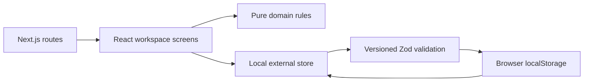
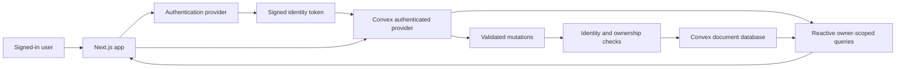

# System design — v0.1

## Responsibility boundaries

The app is an independent codebase with a client-focused workspace. Next.js supplies routing, layouts, build tooling and the deployment boundary. React handles forms and stateful interactions. Pure domain functions implement recommendation and completion rules. Convex will own durable multi-user data and authoritative writes.

## Current running architecture

The storage adapter uses `useSyncExternalStore` to avoid reading browser-only APIs during server rendering. It loads before edits, validates stored data, writes before updating the UI, and reports storage failures. A cross-tab storage event refreshes subscribers. Multiple simultaneous tab edits are still last-writer-wins: this is a local learning adapter, not a collaborative database.

The active session is persisted. A session recap atomically updates the local task and session history in one stored workspace record. Duplicate session IDs cannot award credit twice.

## Planned cloud architecture

There is no need for a separate Express API or Prisma for this design. Query subscriptions deliver database changes to the UI. Convex mutations own transactional writes. Actions are reserved for future external calls, not routine CRUD.

## Identity and future friends

Every cloud document carries `owner`, derived on the server from `ctx.auth.getUserIdentity().tokenIdentifier`. The browser never supplies owner IDs. Queries use owner indexes. ID-based writes check the referenced record's owner, including project and dependency references.

Friends initially get independent personal workspaces in the same deployment. A shared team/workspace model is not assumed. Publicly available source code does not make personal data public.

Authentication choice remains open. Clerk has an official Convex integration and is a documented option; adding another service is a trade-off. Convex Auth and Better Auth can be evaluated in phase 2. The current issuer config trusts no provider when unset, and backend functions reject unauthenticated access.

## Session transaction

Proposed production flow: start session → server records owner/task/start → recap mutation verifies active record → validate contribution and outcome → update task → complete session → create optional artifact → subscribed queries update.

The starter backend currently implements only the full-task recap transaction with an owner-scoped idempotency key. Active session and smaller-step parity with the local UI must be added before switching the UI to cloud mode.

## UI changes stay inexpensive

- `src/app/globals.css`: visual tokens and reusable surfaces; Tailwind is available for incremental redesign.
- `src/components/workspace-screen.tsx`: initial functional screens. Split into feature folders during phase 2 as flows stabilise.
- `src/domain/workspace.ts`: pure rules and validators, independent of React and Convex.
- `src/lib/local-store.ts`: temporary persistence boundary; no simulated cloud success.
- `convex/`: schema and server-authoritative operations.

## Operational boundaries

No analytics, automated posting, third-party AI calls, timers, background reminders or tracking scripts are included. Use separate Convex dev and production deployments. Never deploy a public multi-user release before auth and cross-user isolation checks pass. No live cloud backend has been verified in this phase.

References consulted 15 September 2026: [Next.js installation](https://nextjs.org/docs/app/getting-started/installation), [Convex Next.js quickstart](https://docs.convex.dev/quickstart/nextjs), [Convex with Clerk](https://docs.convex.dev/auth/clerk).

## Phase 2B implemented boundary — 17 September 2026

The workspace architecture above remains local. Separately, `/account` now uses a Better Auth React client → Next.js `/api/auth` proxy → Convex HTTP auth routes → packaged Better Auth component. The account provider supplies the session's token to Convex. `auth.getCurrentUser` checks the live auth session and trusted identity, exposing name/email only. A missing/revoked session returns null to support reactive sign-out. Owner-scoped task functions still reject anonymous callers. Cloud task subscriptions/mutations in the workspace UI are the next phase.

See AUTH_SETUP.md for files, setup and limitations. The auth component owns its own tables; no password fields were added to our application schema. Verification and recovery email delivery remain unimplemented.
