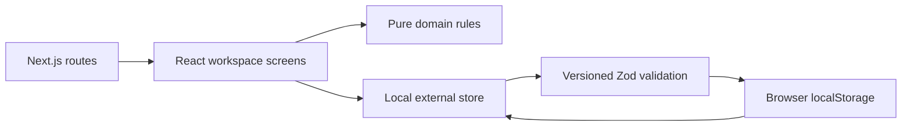
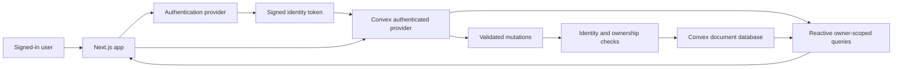

# System design — v0.1

## Responsibility boundaries

The app is an independent codebase with a client-focused workspace. Next.js supplies routing, layouts, build tooling and the deployment boundary. React handles forms and stateful interactions. Pure domain functions implement recommendation and completion rules. Convex will own durable multi-user data and authoritative writes.

## Current running architecture



The storage adapter uses `useSyncExternalStore` to avoid reading browser-only APIs during server rendering. It loads before edits, validates stored data, writes before updating the UI, and reports storage failures. A cross-tab storage event refreshes subscribers. Multiple simultaneous tab edits are still last-writer-wins: this is a local learning adapter, not a collaborative database.

The active session is persisted. A session recap atomically updates the local task and session history in one stored workspace record. Duplicate session IDs cannot award credit twice.

## Planned cloud architecture



There is no need for a separate Express API or Prisma for this design. Query subscriptions deliver database changes to the UI. Convex mutations own transactional writes. Actions are reserved for future external calls, not routine CRUD.

## Identity and future friends

Every cloud document carries `owner`, derived on the server from `ctx.auth.getUserIdentity().tokenIdentifier`. The browser never supplies owner IDs. Queries use owner indexes. ID-based writes check the referenced record's owner, including project and dependency references.

Friends initially get independent personal workspaces in the same deployment. A shared team/workspace model is not assumed. Publicly available source code does not make personal data public.

Better Auth with the Convex component is the selected identity system. Development email/password is implemented; backend functions derive ownership from the trusted Convex identity and reject unauthenticated access. Email verification and recovery still need a delivery provider before production.

## Session transaction

Proposed production flow: start session → server records owner/task/start → recap mutation verifies active record → validate contribution and outcome → update task → complete session → create optional artifact → subscribed queries update.

The starter backend currently implements only the full-task recap transaction with an owner-scoped idempotency key. Active session and smaller-step parity with the local UI must be added before switching the UI to cloud mode.

## UI changes stay inexpensive

- `src/app/globals.css`: visual tokens and reusable surfaces; Tailwind is available for incremental redesign.
- `src/components/workspace-screen.tsx`: initial functional screens. Split into feature folders during phase 2 as flows stabilise.
- `src/domain/workspace.ts`: pure rules and validators, independent of React and Convex.
- `src/lib/local-store.ts`: temporary persistence boundary; no simulated cloud success.
- `convex/`: schema and server-authoritative operations.

## Operational boundaries

No analytics, automated posting, third-party AI calls, timers, background reminders or tracking scripts are included. Use separate Convex dev and production deployments. The development backend and two-account task isolation are verified; production is not configured or deployed.

References consulted 15 September 2026: [Next.js installation](https://nextjs.org/docs/app/getting-started/installation), [Convex Next.js quickstart](https://docs.convex.dev/quickstart/nextjs), [Convex with Clerk](https://docs.convex.dev/auth/clerk).

## Phase 2B implemented boundary — 17 September 2026

At that checkpoint the workspace architecture remained local. `/account` uses a Better Auth React client → Next.js `/api/auth` proxy → Convex HTTP auth routes → packaged Better Auth component. The account provider supplies the session's token to Convex. `auth.getCurrentUser` checks the live auth session and trusted identity, exposing name/email only. A missing/revoked session returns null to support reactive sign-out.

See AUTH_SETUP.md for files, setup and limitations. The auth component owns its own tables; no password fields were added to our application schema. Verification and recovery email delivery remain unimplemented.

## Phase 2C implemented Work path — 24 September 2026

`/work` now takes a separate cloud path while the other five workspace sections keep using the local store:

```mermaid
flowchart LR
  Route[/work route] --> Gate[Better Auth session + Convex identity gate]
  Gate -->|signed out| Account[/account]
  Gate -->|signed in| Hook[usePaginatedQuery / useMutation]
  Hook --> API[tasks.listPage / create / update]
  API --> Owner[requireOwner + assertOwner]
  Owner --> DB[(Convex tasks)]
  DB --> Sub[Reactive subscription]
  Sub --> Hook
```

`WorkspaceScreen` returns the cloud Work feature before loading any visible local task board. `CloudWorkScreen` owns auth/loading/error/empty states and task forms. `WorkspaceSidebar` keeps navigation shared between cloud and local shells. The list query returns only fields the UI needs and omits the internal owner token. Mutations validate again on the server; browser constraints improve usability but are not the security boundary.

There is deliberately no automatic local-to-cloud copy. Today and Work use the same owned Convex task source, and Ideas now saves to the same signed-in account. Proof, Journey and Settings still use the earlier browser-local prototype until their migration slices.

## Phase 2D backend-only session slice — 24 September 2026

Convex now stores at most one active full-task session per owner in `activeSessions`. `tasks.startSession` derives the owner, checks the owned task and its prerequisites, then creates the active record. A repeated start for the same task returns the existing record; starting another task first requires finishing or cancelling. `tasks.cancelSession` removes the owned active record without recording a contribution. `tasks.recordSession` derives the task and start time from the active record, validates recap input, inserts the historical session, updates task status and next step, creates an optional draft artifact, then deletes the active record in one mutation. Repeating a completed recap returns the existing session ID through the `(owner, key)` index, where the key is the active record ID.

### Smaller-step extension — 24 September 2026

The Work form can store one optional three-part smaller step on a cloud task: action, estimate and done condition. The server validates it as a complete group. `startSession` accepts a mode flag and snapshots the selected focus, so an in-flight edit does not rewrite what the person started. `recordSession` stores that snapshot in history. Finishing a smaller step keeps its parent task In progress and removes the step from the task only when it still matches the active snapshot; a replacement step edited during focus remains. Browser-local records are not copied to Convex without a user decision.

### Cloud Today client — 24 September 2026

`WorkspaceScreen` routes `/today` to a dedicated authenticated `CloudTodayScreen` before initializing the local-workspace hook. Time and energy are React state because they are temporary choices. `tasks.todayOverview` derives the owner from the auth session, reads Ready/In progress tasks, checks owned prerequisites, uses the last six owned session lanes for an explainable ranking, and returns three feasible focuses plus the owned active-session snapshot. The client calls `startSession`, `cancelSession` and `recordSession`; Convex subscriptions replace the screen state after each mutation and on reload. No task, session or recap is persisted in browser storage on this route.

The query currently collects the owner's eligible tasks before ranking them. This is suitable for the initial personal workspace, but a later growth pass should bound/paginate the candidate pool and explain how older tasks remain discoverable. The older browser-local records remain untouched under the user's fresh Convex start choice.

## Phase 3B bounded Ideas slice — 25 September 2026

`WorkspaceScreen` routes `/ideas` to `CloudIdeasScreen` before mounting the browser-local hook. The screen checks Better Auth and Convex identity, then uses a paginated `ideas.listPage` subscription and `create`, `updateNotes` and `activate` mutations. Convex derives the owner from the trusted identity for every operation. An idea is an unscheduled notebook entry; activation is a separate form that defines one concrete Ready task. The activation mutation inserts the task and patches the idea's task link transactionally. A retry returns the existing linked task, preventing duplicate Work items. Work and Today subsequently read that same task through their existing cloud queries. No new library or background ChatGPT integration is involved.

The user chose to begin fresh in Convex and preserve the old browser workspace. The visible old workspace showed one seeded example idea and no recorded sessions, but the browser tool could not inspect the complete raw storage object; therefore no claim is made that every old record was enumerated. Proof, Journey and Settings remain local prototypes and will move in later bounded slices.
