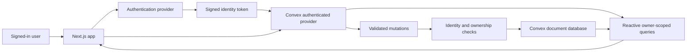

# System design — v0.1

## Responsibility boundaries

The app is an independent codebase with a client-focused workspace. Next.js supplies routing, layouts, build tooling and the deployment boundary. React handles forms and stateful interactions. Convex owns durable, owner-scoped data and authoritative writes. Today's ranking rules are a pure function in `convex/lib/recommend.ts`, independent of the database.

## Current running architecture (2 October 2026)

```mermaid
flowchart LR
  Root[app/layout.tsx: one Convex client + Better Auth provider] --> Shell["(workspace)/layout.tsx: sidebar, top bar, sign-in gate"]
  Root --> Account[/account]
  Shell --> Page["(workspace)/[section]/page.tsx"]
  Page --> Screens[Today · Work · Ideas · Proof · Journey · Settings]
  Screens --> Q[Reactive owner-scoped queries]
  Screens --> M[Validated mutations]
  M --> Guard[requireOwner + assertOwner]
  Q --> Guard
  Guard --> DB[(Convex tables)]
```

The browser-local adapter that this section described until 2 October was unrouted after Phase 2F and was removed in the review fixes (it remains in Git history at 542b6f3). The rest of this section's history is kept below, phase by phase, as it was true at each checkpoint.

## Planned cloud architecture (original 15 September plan, now implemented as above)

```mermaid
flowchart LR
  User[Signed-in user] --> Next[Next.js app]
  Next --> Auth[Authentication provider]
  Auth --> Token[Signed identity token]
  Token --> CP[Convex authenticated provider]
  Next --> CP
  CP --> Q[Reactive owner-scoped queries]
  CP --> M[Validated mutations]
  M --> Guard[Identity and ownership checks]
  Guard --> DB[Convex document database]
  DB --> Q
  Q --> Next
```

There is no need for a separate Express API or Prisma for this design. Query subscriptions deliver database changes to the UI. Convex mutations own transactional writes. Actions are reserved for future external calls, not routine CRUD.

## Identity and future friends

Every cloud document carries `owner`, derived on the server from `ctx.auth.getUserIdentity().tokenIdentifier`. The browser never supplies owner IDs. Queries use owner indexes. ID-based writes check the referenced record's owner, including project and dependency references.

Friends initially get independent personal workspaces in the same deployment. A shared team/workspace model is not assumed. Publicly available source code does not make personal data public.

Better Auth with the Convex component is the selected identity system. Development email/password is implemented; backend functions derive ownership from the trusted Convex identity and reject unauthenticated access. Email verification and recovery still need a delivery provider before production.

## Session transaction

Proposed production flow: start session → server records owner/task/start → recap mutation verifies active record → validate contribution and outcome → update task → complete session → create optional artifact → subscribed queries update.

The starter backend currently implements only the full-task recap transaction with an owner-scoped idempotency key. Active session and smaller-step parity with the local UI must be added before switching the UI to cloud mode.

## UI changes stay inexpensive

- `src/app/globals.css`: visual tokens and reusable surfaces; Tailwind is available for incremental redesign.
- `src/components/workspace-sections.ts`: each section's name, icon and copy in one place (sidebar, shell and tab titles read it).
- `src/components/workspace-shell.tsx`: the persistent sidebar/top bar and the single sign-in gate.
- `src/components/cloud-*-screen.tsx`: one content component per section; no auth or layout code inside.
- `convex/lib/recommend.ts`: pure Today ranking and reasons, tested without a database.
- `convex/`: schema and server-authoritative operations.

## Operational boundaries

No analytics, automated posting, third-party AI calls, timers, background reminders or tracking scripts are included. Use separate Convex dev and production deployments. The development backend and two-account task isolation are verified; production is not configured or deployed.

References consulted 15 September 2026: [Next.js installation](https://nextjs.org/docs/app/getting-started/installation), [Convex Next.js quickstart](https://docs.convex.dev/quickstart/nextjs), [Convex with Clerk](https://docs.convex.dev/auth/clerk).

## Phase 2B implemented boundary — 17 September 2026

At that checkpoint the workspace architecture remained local. `/account` uses a Better Auth React client → Next.js `/api/auth` proxy → Convex HTTP auth routes → packaged Better Auth component. The account provider supplies the session's token to Convex. `auth.getCurrentUser` checks the live auth session and trusted identity, exposing name/email only. A missing/revoked session returns null to support reactive sign-out.

See AUTH_SETUP.md for files, setup and limitations. The auth component owns its own tables; no password fields were added to our application schema. Verification and recovery email delivery remain unimplemented.

## Phase 2C implemented Work path — 24 September 2026

`/work` now takes a separate cloud path while the other five workspace sections keep using the local store:

```mermaid
flowchart LR
  Route[/work route] --> Gate[Better Auth session + Convex identity gate]
  Gate -->|signed out| Account[/account]
  Gate -->|signed in| Hook[usePaginatedQuery / useMutation]
  Hook --> API[tasks.listPage / create / update]
  API --> Owner[requireOwner + assertOwner]
  Owner --> DB[(Convex tasks)]
  DB --> Sub[Reactive subscription]
  Sub --> Hook
```

`WorkspaceScreen` returns the cloud Work feature before loading any visible local task board. `CloudWorkScreen` owns auth/loading/error/empty states and task forms. `WorkspaceSidebar` keeps navigation shared between cloud and local shells. The list query returns only fields the UI needs and omits the internal owner token. Mutations validate again on the server; browser constraints improve usability but are not the security boundary.

There is deliberately no automatic local-to-cloud copy. Today and Work use the same owned Convex task source, Ideas saves to that account, Journey reads its saved recaps, Proof reads linked evidence drafts, and Settings saves the motive in an owned profile. The earlier browser-local workspace remains preserved but is no longer mounted by any routed workspace screen.

## Phase 2D backend-only session slice — 24 September 2026

Convex now stores at most one active full-task session per owner in `activeSessions`. `tasks.startSession` derives the owner, checks the owned task and its prerequisites, then creates the active record. A repeated start for the same task returns the existing record; starting another task first requires finishing or cancelling. `tasks.cancelSession` removes the owned active record without recording a contribution. `tasks.recordSession` derives the task and start time from the active record, validates recap input, inserts the historical session, updates task status and next step, creates an optional draft artifact, then deletes the active record in one mutation. Repeating a completed recap returns the existing session ID through the `(owner, key)` index, where the key is the active record ID.

### Smaller-step extension — 24 September 2026

The Work form can store one optional three-part smaller step on a cloud task: action, estimate and done condition. The server validates it as a complete group. `startSession` accepts a mode flag and snapshots the selected focus, so an in-flight edit does not rewrite what the person started. `recordSession` stores that snapshot in history. Finishing a smaller step keeps its parent task In progress and removes the step from the task only when it still matches the active snapshot; a replacement step edited during focus remains. Browser-local records are not copied to Convex without a user decision.

### Cloud Today client — 24 September 2026

`WorkspaceScreen` routes `/today` to a dedicated authenticated `CloudTodayScreen` before initializing the local-workspace hook. Time and energy are React state because they are temporary choices. `tasks.todayOverview` derives the owner from the auth session, reads Ready/In progress tasks, checks owned prerequisites, uses the last six owned session lanes for an explainable ranking, and returns three feasible focuses plus the owned active-session snapshot. The client calls `startSession`, `cancelSession` and `recordSession`; Convex subscriptions replace the screen state after each mutation and on reload. No task, session or recap is persisted in browser storage on this route.

The query currently collects the owner's eligible tasks before ranking them. This is suitable for the initial personal workspace, but a later growth pass should bound/paginate the candidate pool and explain how older tasks remain discoverable. The older browser-local records remain untouched under the user's fresh Convex start choice.

## Phase 3B bounded Ideas slice — 25 September 2026

`WorkspaceScreen` routes `/ideas` to `CloudIdeasScreen` before mounting the browser-local hook. The screen checks Better Auth and Convex identity, then uses a paginated `ideas.listPage` subscription and `create`, `updateNotes` and `activate` mutations. Convex derives the owner from the trusted identity for every operation. An idea is an unscheduled notebook entry; activation is a separate form that defines one concrete Ready task. The activation mutation inserts the task and patches the idea's task link transactionally. A retry returns the existing linked task, preventing duplicate Work items. Work and Today subsequently read that same task through their existing cloud queries. No new library or background ChatGPT integration is involved.

The user chose to begin fresh in Convex and preserve the old browser workspace. The visible old workspace showed one seeded example idea and no recorded sessions, but the browser tool could not inspect the complete raw storage object; therefore no claim is made that every old record was enumerated. The legacy local-store module remains for reference; routed workspace screens no longer mount it.

## Phase 2E Journey history foundation — 29 September 2026

`WorkspaceScreen` routes `/journey` to `CloudJourneyScreen` before mounting the local-store hook. Its Better Auth and Convex identity gate matches Today, Work and Ideas. `usePaginatedQuery` subscribes to `journey.listPage`, which derives the owner server-side and pages by the `by_owner_endedAt` index. A saved Today recap creates a `sessions` document; the reactive Journey list then shows its contribution, outcome, focus snapshot and next step. Cancelled sessions create no document. The lane totals count only loaded pages, visibly labeled as such. Weekly goals, streaks, Proof and Settings are outside this slice.

## Phase 4B bounded Proof gallery — 29 September 2026

`WorkspaceScreen` now routes `/proof` to `CloudProofScreen` before mounting the browser-local hook. Its identity gate matches the other cloud sections. A Today recap with a validated evidence URL writes an owned Draft artifact in the same transaction as its session. The Proof client subscribes to `proof.listPage`, which pages only that owner's artifacts and joins each source session after checking its owner. A malformed cross-owner session reference yields no source details. The gallery displays the link, Draft status and contribution context; it performs no publication action. The full editable Draft/Ready/Published workflow remains a later product decision.

## Phase 2F cloud Settings motive — 29 September 2026

All six `WorkspaceScreen` sections now mount under `AuthProvider` with cloud feature screens. `/settings` checks Better Auth and Convex identity, queries `settings.getProfile`, and saves a validated motive through `settings.saveMotive`. The mutation derives owner, looks up `profiles.by_owner`, and creates or patches only the motive. The `WorkspaceSidebar` skips its profile subscription until Convex confirms authentication, then shows the saved motive across routes. If no profile exists, it offers a Settings link rather than presenting sample copy as a personal choice. The schema makes timezone and weekly target optional; at this checkpoint those rules and a complete cloud export were future work (both arrived on 2 October; see Product phases below). The old browser-only export action was removed from the routed Settings screen without deleting the old browser records.

## Review fixes — 2 October 2026

**One client, one shell.**

- Until this checkpoint, every `[section]` page mounted its own `AuthProvider`, which created a `ConvexReactClient` in state.
- Next 16 keeps only the current page mounted unless `cacheComponents` is enabled. So each section change unmounted the page, built a new client and its auth handshake, and never closed the old client. A browser check showed three sections giving three distinct clients.
- The client is now created once, at module level in `src/components/auth-provider.tsx`, and the provider wraps the root layout. When the public Convex variables are missing, the provider shows setup guidance instead of crashing.
- The six screens moved under the `app/(workspace)` route group. A route group adds no URL segment, and its layout persists across the sections, so the sidebar, its motive subscription and the single sign-in gate (`workspace-shell.tsx`) survive navigation. A browser check showed the same client and sidebar element across five navigations.
- Screens are content-only. Per-section titles come from `generateMetadata` with the root template `%s · Becoming`.
- Unknown addresses render `(workspace)/not-found.tsx` inside the shell without the sign-in gate; that page holds no private data. New routes under the group must be added to `workspaceSections` to stay gated.

**Lifecycle and ranking.**

- `tasks.listPage` serves Work's Active / Blocked / Done / Archived views. Active uses the owner index plus a status filter; the others use `by_owner_status`.
- `unblock`, `reopen`, `archive` and `restore` check ownership and the current status on the server. Archiving is refused while that task's session is open. Restoring returns the task to `archivedFrom`.
- Today and the session mutations accept only Ready or In-progress tasks, so archived work can't be recommended or started.
- `todayOverview` filters prerequisites, then calls `rankFocuses` (`convex/lib/recommend.ts`), which applies the documented rules and generates the reason from the same facts.
- Today keeps the previous result on screen while new capacity arguments load (Convex returns `undefined` during that time). The controls stay mounted and keep keyboard focus.

**Errors.** Screens show `ConvexError.data` through `src/lib/errors.ts`; other failures get a calm fallback, and the Convex client still logs details to the console.

## Product phases — 2 October 2026

This section covers small gaps and quick wins, 4A, 4B, 3A, 3B, 3C, 4C, 5A and 5B. No new dependencies; everything uses Convex built-ins (queries, mutations, file storage) and browser APIs.

### Module map

| Layer | Module | Responsibility |
|---|---|---|
| Convex functions | `tasks.ts` | Work views, task create/edit/lifecycle, prerequisites, pinning, Today overview, sessions |
| | `projects.ts` | Projects, milestones (ordered), detail, task-form options, case-study data |
| | `ideas.ts` | Notebook, structured brainstorm, activation (with project or smaller step), moving back |
| | `proof.ts` | Proof views, details, status, candidates, evidence for past sessions, screenshots |
| | `journey.ts` | History with evidence, lifetime counts and firsts |
| | `rhythm.ts` | Timezone and target, pauses, reflections, one rhythm overview |
| | `settings.ts` | Motive, lane preference |
| | `data.ts` | Export, restore into an empty workspace, batched deletion |
| Pure rules (tested without a database) | `lib/recommend.ts` | Ranking, reasons, pin explanation |
| | `lib/rhythm.ts`, `lib/time.ts` | Commitments and streaks; timezone week and day maths |
| | `lib/taskRules.ts`, `lib/projects.ts`, `lib/validate.ts` | Shared validation, link checks, milestone refresh |
| | `lib/caseStudy.ts` | Markdown case-study draft from records |
| Client | `use-rhythm.ts` | `useNow` clock, the rhythm subscription, derived weeks and streaks |
| | `rhythm.tsx`, `journey-extras.tsx`, `projects-view.tsx`, `task-forms.tsx`, `data-controls.tsx` | Feature components used by the six screens |

### Decisions and why

- **Week maths runs in the browser.** Convex caches a query's result and doesn't re-run it as time passes, and its runtime's timezone data couldn't be verified. So `rhythm.overview` takes the client's time rounded to the hour and returns raw records: timezone, commitments, and session end times for about 27 weeks. The browser applies the saved timezone with Intl, using the tested `lib/time.ts` and `lib/rhythm.ts`. Mutations accept only week keys near the server's own clock, so finished weeks can't be edited.
- **No clock reads during render.** React Compiler lint rules forbid impure calls in render, so `useNow` starts as `null` and ticks from a timer. Today's elapsed time works the same way.
- **Settled results.** Today keeps its previous answer while a query with new arguments loads (`useSettled`), so controls never unmount mid-click.
- **Recommendations stay explainable.** The ranking adds pins and a lane preference as two transparent rules. Reasons are generated from the same facts, and choices plus swap reasons are recorded for the trial without changing history.
- **Uploads go straight to Convex.** The browser asks `proof.generateUploadUrl`, posts the file, then calls `attachImage`. That call checks the server's own metadata (type and size) and that the file isn't already in use. A rejected file is deleted and the reason returned, because throwing would roll back the deletion.
- **Derived, never stored.** Milestone progress, idea stages, week results, streaks, lifetime counts and firsts are computed from records each time. Only `milestones.completedAt` and `artifacts.candidateSince` record a moment, and both are cleared when their condition stops being true.
- **Prerequisites clear when Done or archived.** One rule (`lib/taskRules.prerequisiteCleared`) is used by Today and by session start, so set-aside work can't silently hide a task.
- **Week keys are checked in the person's timezone.** The browser computes the key; the server recomputes it with `weekKey` when its runtime supports the timezone, and otherwise accepts only a week current somewhere on Earth.
- **Restore is all-or-nothing.** `data.importBackup` runs in one transaction, only into an empty workspace, and rebuilds every link from the backup's original IDs. It reuses the forms' validators (`lib/taskRules`, `lib/ideaRules`, `lib/validate`) and checks cross-record rules first (`assertRestorable`), so a hand-edited backup can't create data the app itself would refuse. Deletion runs in batches of 400 so a large workspace stays inside transaction limits.
- **Account deletion order.**
  1. Confirm the password by signing in again.
  2. Delete workspace data while Convex still recognises the person.
  3. Delete the Better Auth user.

  A wrong password therefore stops everything before any data is touched.
- **Offline is visible.** The shell reads `useConvexConnectionState`. When the socket drops after having connected, it says so, because Convex queues changes and sends them on reconnect.

### Growth limits, by design for a personal workspace

| Read | Bound |
|---|---|
| Today's candidates | 200 oldest Ready and 200 oldest In progress, always plus the pinned task |
| The rhythm window | 2,000 sessions in about 27 weeks |
| `journey.summary` | 10,000 sessions, 5,000 artifacts and 2,000 milestones |
| Export | 10,000 per table |
| Restore | 4,000 records (an export can hold up to 10,000 per table, so a very large export would need a staged restore) |
| Deletion | 400 documents per call |

Each limit is named in code where it's applied.

## Ember Glass redesign — 2 October 2026

The owner's design ("Becoming App Design", claude.ai/design) is now the interface. See [DESIGN_SYSTEM.md](DESIGN_SYSTEM.md).

- **Shell.** On desktop there is an icon rail, and on phones a floating pill. A shared header shows the date (mono), the serif headline (on Today, your motive), quick idea capture (⌘/Ctrl K) and an avatar link to Settings. The sign-in gate and offline note are unchanged.
- **Today** follows the design's flow:
  1. The capacity dial (15–120 minutes) and energy.
  2. One focus card: lane and project, done-when, why it was suggested, Start.
  3. Explicit alternatives with swap reasons, and "Rest tonight", which hides suggestions for the evening and records nothing.
  4. The focus orb: a timer against your plan, plus rotating encouragement.
  5. An outcome-first recap with skills and evidence. If saving fails, the recap keeps everything you typed.

  On wide screens, a three-column dashboard adds the Mind Bloom, lane balance, the week, the focused project's milestones, the proof pipeline and five weeks of contributions.
- **Honest visuals.** The Mind Bloom, week dots, heatmap and pipeline are drawn only from records. Their empty states explain why they're empty. The design's demo values exist only in the dev-only preview pages, labelled as sample.
- **Dark only.** The design has no light theme, so `color-scheme: dark`. Contrast is still measured: `src/lib/contrast.test.ts`.
- **No new dependencies.** The fonts are self-hosted with `next/font/local`, and the SVG visuals are hand-drawn components.

## Ritual redesign — 6 October 2026

The owner's *Becoming Ritual* design replaces Ember Glass. See [DESIGN_SYSTEM.md](DESIGN_SYSTEM.md) and, for the backend changes, [DATABASE.md](DATABASE.md).

- **Shell.** A 92px rail (orb, + capture, Today, Work, Ideas, Journey, avatar) on desktop and a floating pill with + in the middle on phones. The top bar is gone; each screen owns its header. `RitualProvider` (`src/components/ritual/ritual-context.tsx`) holds the capture sheet, the new-project sheet and the toast, so any screen can open them.
- **Today is a short conversation**, held in component state: open → which project → check-in → plan, then the focus, recap and reward overlays and "Tonight is done" (a per-tab flag in `sessionStorage`). Time and energy stay temporary UI state. The intent scopes `tasks.todayOverview` by lane, project or task; the alternatives come from the other lanes. Links like `/today?intent=build&project=<id>` open the check-in directly.
- **Weekly plan.** The review saves a `weekPlans` row: an intention and up to 12 lined-up tasks. Lined-up tasks rank right after a pinned task, and the intention feeds Today's prompt card and Sunday card.
- **Onboarding** appears for a brand-new account (`getProfile().needsOnboarding`) and saves the motive, rhythm, reminder preference and an optional first task, then `completeOnboarding`.
- **Proof lives under Journey** (`/journey?tab=proof`, with the publish flow at `&publish=<id>`); `/proof` redirects there. Deep links use small single-item reads (`ideas.get`, `proof.get`, `tasks.get`) so they work beyond the first page.
- **Reminders are preferences only.** Nothing sends them yet; that needs a notification service (Phase 6).
- **Honest data, no new dependencies, dark only** — unchanged from Ember Glass. The dev-only `/design-preview` pages were removed with the old screens.

## Assistants (MCP) and the Inbox — 9 October 2026

- **The endpoint.** Becoming answers MCP at `https://<deployment>.convex.site/mcp` (`convex/mcp.ts`), a Convex HTTP action next to auth and data. The owner is resolved from an access token's SHA-256 hash, and every tool then runs as an internal query or mutation with that owner. Reads reuse the app's code; writes become Inbox proposals.
- **Why proposals.** The record stays honest: an assistant can be wrong about minutes or outcomes, so nothing counts until you approve it. Approval runs the same rules as the app.
- **Why tokens first.** Claude Code and other local MCP clients send a fixed header, which a token covers with no new dependencies. The Claude app and ChatGPT connect from their own servers through OAuth, which needs the deployed app as a public authorization server. See [ASSISTANTS.md](ASSISTANTS.md).

## Evening reminders — 9 October 2026

A Convex cron (`crons.ts`, every 15 minutes) asks `reminders.due` who has just reached their chosen time in their own timezone, then sends one email (Resend) and one empty Web Push per device (`lib/webpush.ts`, VAPID-signed with Web Crypto). The service worker (`public/sw.js`) shows the text and opens Today. Empty pushes avoid payload encryption entirely, so there is no dependency. The cost is a fixed message; the email carries tonight's suggested step.

## Project constellation — 9 October 2026

- **One query, the whole map.** `constellation.get` (`convex/constellation.ts`) reads a project's phases, milestones, tasks, docs, idea, research, report and recent task events in one go and derives everything else: codes (`05`, `5A`, `5A·1`), % and state per phase and milestone, sessions and focused minutes, which phases each doc feeds and how many tasks it informs, and the replay window. Nothing derived is stored, so the map can't drift from the records.
- **Replay is computed in the browser** from each task's `startedAt`, `completedAt` and `blockedAt` (`model.ts` `stateAt`), so scrubbing doesn't query the server again.
- **Claude keeps it current through proposals.** The constellation tools and `import_plan` go through the Inbox like every other assistant write. A plan is applied in one transaction (`inbox.applyPlan`) and only adds what's missing, so the same plan can be sent again after the docs change. See [ASSISTANTS.md](ASSISTANTS.md) and [PLAN-project-constellation.md](PLAN-project-constellation.md).
- **Docs stay in the repo.** Becoming stores each doc's code, summary, sections, link and the phases it feeds, not its text.
